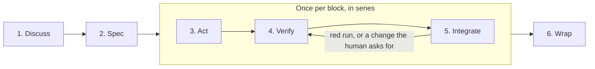

# Workflow

How work moves through this repository: scope, evidence, design judgement, phases, reviews, integration. Engineering
norms are in `agents/engineering.md`; writing rules in
`agents/writing.md`.

**This document states its mandate before its argument**
(`docs/adr/0029-a-workflow-phase-states-its-mandate-before-its-argument.md`, decision 1). The bullets bind. The
`**Detail.**` paragraph that closes a section explains and binds nothing: a reader who stops at the last bullet has
read every rule that section carries.

## Scope

- **Stay inside the repository.** Never read, list or search `$HOME`, parent directories, or another repository; a git
  worktree is its own root.
- **An adjacent defect has three tiers**. No diff hunk should be unexplainable by the request or by the answer the
  operator gave.
    1. **Trivial, obviously correct and contained** : fixed in the change that finds it, flagged in the final message.
    2. **Larger, and reachable inside this lot**: stop and ask the operator **at the moment of discovery**, stating the
       defect, the size of the fix and the block it would join. Not at the next boundary.
    3. **Refused by the operator, or genuinely another lot's**: the backlog.
- **Asking is not optional and neither is stopping.** Tier 2 is a question, so the work waits for the answer. Fixing it
  unasked and backlogging it silently are both wrong.

**Detail.** Tier 1 is the boy-scout rule. Tier 2 asks at the moment of discovery rather than at the next boundary
because the operator prefers being interrupted while the context is live over rebuilding it afterward; it is also the
tier where the backlog drains.

## Evidence

- **Nothing is asserted without the command that established it, nothing changed without the diff.**
- **A measurement an existing document carries is dated, not current**: re-run it before acting on it, and correct the
  document when the numbers differ.
- **A check that cannot fail is not a check.** Before offering a command as evidence, name the output that would have
  proved you wrong.
- **File content is written with the edit tool, never by a command** (redirection, heredoc, `tee`,
  `sed -i`). Exceptions: throwaway output, and commands whose declared product is the file (formatter, scaffolder,
  generator, compiler).
- **Refuted beats plausible.** Drop a hypothesis the user's evidence contradicts.
- **Consult the current upstream documentation of the thing itself**, for any library, command line tool or
  version-dependent value, whatever the ecosystem, through the documentation source the session declares. **Name that
  source when a claim rests on it.**

**Detail.** Naming the source is the documentation rule's only observable.

## Design (how to decide)

- **Prefer the convention the tool already has**; a new abstraction is justified in one line naming the convention found
  insufficient.
- **Fix the design, do not work around it.**
- **Name the root cause, not only the symptom**: a backlog entry born from a structural symptom names the design smell
  and the refactor that removes it. Fixing inline is still forbidden.
- **Refactor as a first-class solution**: propose it during Discuss/Design, the human arbitrates, the ADR records. Never
  refactor inline without being asked.
- **Never move or rename something to escape a constraint**: satisfy it or report a blocker.
- **A setting that should not exist is not fixed by a good default**: say it should not be there.

**Detail.** Decisions already taken are under Design invariants in `agents/engineering.md`. Smells that say the design
is being worked around: the same explanatory comment repeated at several sites; a domain type widened to nullable; a
workaround for a tool limitation nobody verified.

## Phases

**Tier Direct is not drawn**: it skips Discuss, Spec and both reviews, and the lead writes Act, Verify, Integrate and
Wrap inline. The diagram carries order and nothing else.

- **A work session produces a `lot`, composed of autonomous `blocks`.**
- **Two agents share it**: the **lead**, the main loop the operator talks to, which keeps the lot's thread and writes no
  block of a tier Spec lot; and one **teammate** per block, a named background agent that implements it and is stopped
  when its pull request merges.
- **Every agent the lead dispatches is named, reviews included.**
- **A review is still not a correspondent**: one brief out, one report back, and the lead never sends a review agent a
  second message except to ask again for a report that did not arrive.
- **Each block is its own branch off `main`**, cut before the first file is written. Committing is cheap: commit
  autonomously.
- **Discuss and Spec run once for the lot. Act, Verify and Integrate run once per block, in series**, a block's pull
  request merged before the next block starts. Wrap closes the lot.

**Detail.** The two roles are `docs/adr/0023-act-in-a-teammate-per-block.md`; naming every dispatched agent is
`docs/adr/0028-the-budget-follows-the-ecosystem.md`, decision 4. A name buys recoverability: a report that does not
arrive, or arrives truncated, can be asked for again instead of costing a second full review.

### Tiers

- **The tier is the operator's decision**: state the recommended tier and its trigger, then wait.
- **Recommend the higher when both fit**; if the higher trigger surfaces mid-task, stop and ask again.

| Tier   | Trigger                                                                    | What runs                                                                       | Reviews                                                                 |
|--------|----------------------------------------------------------------------------|---------------------------------------------------------------------------------|-------------------------------------------------------------------------|
| Direct | One block: no design decision, no new dependency, no public-surface change | Act, Verify, Integrate and Wrap, written inline by the lead                     | None by default; the operator may still ask for one                     |
| Spec   | Anything else                                                              | Discuss, Spec, then Act, Verify and Integrate per block in a teammate, then Wrap | The specification review, and the holistic review at the head of Wrap    |

### What a block is

- **A block is the smallest change that can be merged to `main` on its own.** Three conditions:
- **Green alone.** `dagger call gate` passes at the block's tip. A block therefore never ends between a red test commit
  and the implementation that answers it.
- **Coherent alone.** Nothing it adds is unreachable: every new port method has a caller, every configuration key is
  read, every new state is produced somewhere. Where a surface's real consumer arrives in a later block, the spec says
  so and the pull request repeats it.
- **Readable alone.** The diff stays under 600 lines, and its production lines stay under the bound of the ecosystem
  they belong to: **under 200 under `api/`, under 400 under `clients/`**, both strict. `.dagger/` takes the 200. The
  repository root has no production line at all. A block spanning both ecosystems measures each against its own bound.
  Past any bound the block splits, or the spec states in one line why it cannot.
- **Outside the count**: the dated documents (`docs/specs`, `docs/adr`, `docs/handoffs`) and the files marked
  `linguist-generated`, which are `.dagger/sdk/**`, `clients/pnpm-lock.yaml` and `contract/openapi.json`.
- **Production is counted by prefix**: `api/**/src/main/**`, `.dagger/src/**` and `clients/**/src/**`, less
  `clients/**/src/journeys/**`, `clients/**/src/test/**` and any `*.test.ts` or `*.test.tsx`. Configuration, message
  catalogues, markdown and build files are outside the production count and inside the 600.

**Detail.** The bounds are `docs/adr/0028-the-budget-follows-the-ecosystem.md`, decision 1. Markup was the argument for
the 400 and there is none under `.dagger/`; the partition above leaves the repository root no production line, so only
the 600 ever bounds a root path. Counting by prefix is what makes two readers of the same block reach the same number,
the API's tacit `src/main` convention having no equivalent on the clients' side. The budget measures what a human
rereads.

### 1. Discuss

- **Explore the project, read the backlog, and ask the user questions to align.**
- **No code, no files.**

### 2. Spec

- **One document, `docs/specs/<ISO date>-<slug>.md`**, describing in detail the work to do, its block table included.
- **Reviewed once by an adversarial agent** the lead dispatches by name on `agents/reviews/spec.md`, its findings
  closed, then by the user.
- **Delivered in the first block's pull request**, and frozen when the lot's last block merges (`agents/writing.md`).
- **A lot whose subject is this process writes its ADR and no separate spec.**
- **The block table numbers its blocks by tens.** The block count is the table's rows, not its last number; a gap means
  a block was dropped or a number left free, which the table says in the row it keeps or in the line that removes it.

**Detail.** Numbering by tens (`docs/adr/0028-the-budget-follows-the-ecosystem.md`, decision 2) is what lets a block
inserted mid-lot take a number between two existing ones, so no number already written in the prose goes stale.

### 3. Act

- **One block, in a teammate the lead spawns from `main`** once the previous pull request has merged; one teammate
  lives at a time.
- **Its brief points at the block's row in the spec, the spec, `AGENTS.md`, the branch name and the report shape under
  Integrate, and restates nothing.**
- **Strict TDD as `agents/engineering.md` states it.**
- **An adjacent defect found here takes one of the three tiers under Scope, and tier 2 stops the teammate**: it sends
  the question to `main`, which the operator reads, and ends its turn.
- **The operator's answer reaches it through the lead, by name and verbatim**; the lead never answers a tier-2 question
  itself.
- **A blocker takes the same path, a denied permission included, which is never routed through the lead.**
- **The teammate speaks only when it stops, and there are four stops:**
    1. a tier-2 question;
    2. a blocker;
    3. continuous integration has started;
    4. the pull request is ready.

**Detail.** Four stops, not three: `docs/adr/0023-act-in-a-teammate-per-block.md`, decision 5, as
`docs/adr/0028-the-budget-follows-the-ecosystem.md` amends it. Phase 5 operates the last two and holds the mechanics of
all four.

### 4. Verify

- **Entirely on the local branch. No pull request exists yet.**
- **The teammate runs the full gate.**
- **On the last code block of the lot, it writes the handoff first**, from the bodies of the lot's merged pull requests
  (`gh pr view`) and its own block, then reports.

**Detail.** That block then merges like any other, so the handoff is on `main` for the holistic review to read: the
review runs at the head of Wrap (`docs/adr/0028-the-budget-follows-the-ecosystem.md`, decision 6), not here.

### 5. Integrate

- **The teammate pushes, opens the pull request as a draft, reports that continuous integration has started and ends
  its turn.**
- **When the lead tells it the run has settled, it marks the pull request ready and sends the link to `main`.**
- **The pull request's body is the block's report, in five parts**: evidence (gate, continuous integration, the diff
  against the budget), tier-1 fixes, tier-2 questions with their answers, pitfalls, departures from the block table.
- **It is merged only after the human has reviewed it** (rebase only, no local-merge exemption), approval never assumed.
- **A red run, or a change the human asks for, returns the block to Verify**: the lead forwards it by name, the teammate
  commits the fix, re-runs the gate, reports that the new run has started, and marks the pull request ready when the
  lead says that run has settled.
- **The stop for continuous integration applies to every run of the block, not to the first alone.**
- **On the operator's "merged"**, the lead stops the teammate by name and never messages it again, brings the shared
  working tree back to `main` (`git switch main && git pull --ff-only && git branch -d <branch>`), and the next block
  starts from `main`.
- **The gate runs as a foreground command**, under the tool's ten-minute ceiling, which a workstation's gate fits in.
- **The wait for continuous integration stops the teammate.** A monitor is never the mechanism.
- **The lead looks rather than waits**: it establishes a teammate's state from the open pull requests, the remote
  branches and `ListAgents`, never from the arrival of a notice. A teammate whose report draws no answer within a few
  minutes sends it again.

**Detail.** The two stops this phase operates are phase 3's, which carries the list. ADR 0019 decision 3 puts the pull
request back to draft on a new run, so ready is marked again and the wait that precedes it is the same wait. The three
waiting rules are `docs/adr/0028-the-budget-follows-the-ecosystem.md`, decision 3: no run of the measured lot finished
under the ten-minute ceiling and the median was 14.2 minutes, so the foreground branch never applies to continuous
integration, and a background command's completion does not re-invoke an idle agent.

### 6. Wrap

- **Once per lot, and it starts after the last code block has merged.**
- **(a) The holistic review**, in an agent the lead dispatches by name on `agents/reviews/holistic.md`, over
  `git diff <previous lot tag>..origin/main`, with nothing in flight. **All of its findings go to the closing block**,
  there being no other destination. Tier Direct skips it.
- **Then the closing block, the lot's last, with its own pull request**: (b) the holistic findings fixed, each named in
  the handoff with its exit; (c) the backlog reconciled, an item closed by a block having been deleted in that block's
  own pull request; (d) the handoff in `docs/handoffs/<ISO date> - handoff - <context>.md`, written in the last code
  block from the lot's pull requests and corrected here: current state, what was built, pitfalls, what is not
  validated, next step.
- **(e) After that pull request merges, tag the lot**, an annotated `lot/X.Y.Z-<slug>` on the closing merge, pushed.
  This step is not optional.
- **(f) Report what was done and the friction points, and every tier-2 question asked with the answer it got.** That
  report is the input to Improve.
- **The closing work splits like any other block when it passes a bound.** "What a block is" is strict here too, so
  findings that do not fit 600 lines become two pull requests, the seam being the code findings on one side and the
  documents, the backlog and the handoff on the other. Both halves are the closing block.
- **A lot tag is a delivery checkpoint, not a release.** A release is its own decision and its own tag.

**Detail.** The tag of step (e) is the base the next lot's holistic review reads, which is why it is not optional: a lot
left untagged leaves the next review with no artefact. The single destination for holistic findings is
`docs/adr/0028-the-budget-follows-the-ecosystem.md`, decision 6, and the split leaves it unchanged; the web application
lot's blocks 11 and 12 were that split, at 651 counted lines together against a strict 600. A lot tag is not a release
because `release.yml` triggers on `v*` and publishes a signed image to the registry, and the `lot/` prefix cannot match
it.

## The backlog

- **Open items only.** No shipped section: completed work is recorded by its handoff, git history and tag.
- **An item a block closes is deleted in that block's pull request**; Wrap reconciles in the closing block's diff, and
  the result is re-checked on `main` after that merge.
- **A lot closes the backlog items adjacent to its subject.** Binding, not advisory
  (`docs/adr/0018-a-block-is-a-pull-request.md`, decision 6): the spec names every adjacent item, and for each one it
  leaves open it states why, which is the operator's to accept. A lot with no adjacent item says so.
- **An adopted item that does not fit the block's budget becomes its own block**; it is not thereby dropped.
- **An item holds in two lines**, plus a pointer to the dated document carrying its reasoning, with the one exception
  `agents/writing.md` states: an item whose reasoning lives nowhere else keeps it, and says so.
- **There is no cap on how many items the backlog holds.**
- **A review finding has four exits**: fixed inside the lot; a backlog item (work someone will do); an accepted limit
  (written where the decision lives, never copied to the backlog); or refused, with the reason in the handoff. Wrap
  states which exit each finding took. The default is the first.
- **Banded by nature before priority**, four bands: Open work (`P0`, `P1`, `P2`; a priority may hold nothing), Known
  limits (pointers to documents), Before beta (dated events), Features (the roadmap, unsequenced). A limit is not debt.

**Detail.** This section is where the repository writes the two lists out; `docs/backlog.md` names them and states no
member (`docs/adr/0029-a-workflow-phase-states-its-mandate-before-its-argument.md`, decision 2).
`docs/adr/0010-review-finding-dispositions.md` decided the exits: the backlog receives what the operator refused or
what genuinely belongs to another lot, not what was merely out of the original scope. An entry long enough to need
scrolling is an entry nobody rereads, and a cap on the number of items would discard findings to satisfy a number,
where what grew here was the entries and not their count.
