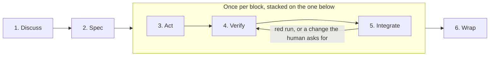

# Workflow

How work moves through this repository: scope, evidence, design judgement, phases, reviews, integration. Engineering
norms are in `agents/engineering.md`; writing rules in
`agents/writing.md`.

**This document states its mandate before its argument**
(`docs/adr/0029-a-workflow-phase-states-its-mandate-before-its-argument.md`, decision 1). The bullets bind. The
`**Detail.**` paragraph that closes a section explains and binds nothing: a reader who stops at the last bullet has
read every rule that section carries.

## Scope

- **Stay inside the repository.** Never read, list or search `$HOME`, parent directories, or another repository; a git
  worktree is its own root.
- **An adjacent defect takes one of the tiers below**. No diff hunk should be unexplainable by the request or by
  the answer the operator gave.
    1. **Trivial, obviously correct and contained** : fixed in the change that finds it, flagged in the final message.
    2. **Larger, and reachable inside this lot**: stop and ask the operator **at the moment of discovery**, stating the
       defect, the size of the fix and the block it would join. Not at the next boundary.
    3. **Refused by the operator, or genuinely another lot's**: the backlog.
- **Asking is not optional and neither is stopping.** Tier 2 is a question, so the work waits for the answer. Fixing it
  unasked and backlogging it silently are both wrong.

**Detail.** Tier 1 is the boy-scout rule. Tier 2 asks at the moment of discovery rather than at the next boundary
because the operator prefers being interrupted while the context is live over rebuilding it afterward; it is also the
tier where the backlog drains.

## Evidence

- **Nothing is asserted without the command that established it, nothing changed without the diff.**
- **A measurement an existing document carries is dated, not current**: re-run it before acting on it, and correct the
  document when the numbers differ.
- **A check that cannot fail is not a check.** Before offering a command as evidence, name the output that would have
  proved you wrong.
- **File content is written with the edit tool, never by a command** (redirection, heredoc, `tee`,
  `sed -i`). Exceptions: throwaway output, and commands whose declared product is the file (formatter, scaffolder,
  generator, compiler).
- **Refuted beats plausible.** Drop a hypothesis the user's evidence contradicts.
- **Consult the current upstream documentation of the thing itself**, for any library, command line tool or
  version-dependent value, whatever the ecosystem, through the documentation source the session declares. **Name that
  source when a claim rests on it.**

**Detail.** Naming the source is the documentation rule's only observable.

## Design (how to decide)

- **Prefer the convention the tool already has**; a new abstraction is justified in one line naming the convention found
  insufficient.
- **Fix the design, do not work around it.**
- **Name the root cause, not only the symptom**: a backlog entry born from a structural symptom names the design smell
  and the refactor that removes it. Fixing inline is still forbidden.
- **Refactor as a first-class solution**: propose it during Discuss/Design, the human arbitrates, the ADR records. Never
  refactor inline without being asked.
- **Never move or rename something to escape a constraint**: satisfy it or report a blocker.
- **A setting that should not exist is not fixed by a good default**: say it should not be there.

**Detail.** Decisions already taken are under Design invariants in `agents/engineering.md`. Smells that say the design
is being worked around: the same explanatory comment repeated at several sites; a domain type widened to nullable; a
workaround for a tool limitation nobody verified.

## Phases



**Tier Direct is not drawn**: it skips Discuss, Spec and both reviews, and the lead writes Act, Verify, Integrate and
Wrap inline. The diagram carries order and nothing else.

- **A work session produces a `lot`, composed of autonomous `blocks`.**
- **The lead and one teammate per block share it**: the **lead**, the main loop the operator talks to, which keeps
  the lot's thread and writes no block of a tier Spec lot; and the **teammate**, a named background agent that
  implements its block, stays idle once its pull request is open, and is stopped when the stack merges.
- **Every agent the lead dispatches is named, reviews included.**
- **A review is still not a correspondent**: one brief out, one report back, and the lead never sends a review agent a
  second message except to ask again for a report that did not arrive.
- **A lot's blocks stack, in the one working tree.** Each block's branch starts from the previous block's, cut before
  the first file is written, and its pull request targets that branch. Committing is cheap: commit autonomously.
- **The lead creates a block's branch with `gh stack add`**; a teammate may add the branches of its own split. **Only
  the lead rewrites the stack.**
- **Discuss and Spec run once for the lot. Act, Verify and Integrate run once per block, one teammate working at a
  time.** Wrap closes the lot.
- **The stack is built, then reviewed**: the next block starts once the previous one's gate is green locally and its
  pull request is open, not once it has merged.

**Detail.** The roles are `docs/adr/0023-act-in-a-teammate-per-block.md`; naming every dispatched agent is
`docs/adr/0028-the-budget-follows-the-ecosystem.md`, decision 4. A name buys recoverability: a report that does not
arrive, or arrives truncated, can be asked for again instead of costing a second full review. The stack is
`docs/adr/0043-blocks-stack-and-a-pull-request-is-written-for-a-tech-lead.md`, decisions 1 and 2: lot `0.38.0` ran
it and no block waited on a review or a merge. A teammate stays idle rather than stopped so that a comment reaches
the agent that wrote the code. There is no worktree per block: `gh stack` 0.1.1 refuses to rebase a branch checked out
in another worktree, and `gh stack init` checks the top branch out, so the lead switches back before committing to a
lower one.

### Tiers

- **The tier is the operator's decision**: state the recommended tier and its trigger, then wait.
- **Recommend the higher when both fit**; if the higher trigger surfaces mid-task, stop and ask again.

| Tier   | Trigger                                                                    | What runs                                                                       | Reviews                                                                 |
|--------|----------------------------------------------------------------------------|---------------------------------------------------------------------------------|-------------------------------------------------------------------------|
| Direct | One block: no design decision, no new dependency, no public-surface change | Act, Verify, Integrate and Wrap, written inline by the lead                     | None by default; the operator may still ask for one                     |
| Spec   | Anything else                                                              | Discuss, Spec, then Act, Verify and Integrate per block in a teammate, then Wrap | The specification review; the holistic review at the head of Wrap, offered rather than dispatched on a lot of one block |

### What a block is

- **A block is the smallest change that can be merged to `main` on its own**, on the conditions below:
    1. **Green alone.** `dagger call gate` passes at the block's tip. A block therefore never ends between a red test
       commit and the implementation that answers it.
    2. **Coherent alone.** Nothing it adds is unreachable: every new port method has a caller, every configuration key
       is read, every new state is produced somewhere. Where a surface's real consumer arrives in a later block, the
       spec says so and the pull request repeats it.
    3. **Readable alone.** **Under 500 changed lines and under 20 changed files**, both strict, the same for the
       whole repository. Past either bound the block splits, or the spec states in one line why it cannot.
- **A changed line is counted per hunk of `git diff -U0`**: each hunk costs the larger of its deleted and added
  counts, and the block costs the sum. A line edited in place costs one.
- **Outside both counts**: the dated documents (`docs/specs`, `docs/adr`, `docs/handoffs`) and the files marked
  `linguist-generated`, which are `.dagger/sdk/**`, `clients/pnpm-lock.yaml` and `contract/openapi.json`. A binary
  file counts one file and no line.
- **Measured after committing**, from anywhere in the repository: the command reads commits, so a file not yet
  committed is missing from the count, however long.
- **Measured against the block's parent branch**, `main` for the lot's first block, in place of `<parent>` below.

```bash
X=(-- ':/' ':/!docs/specs' ':/!docs/adr' ':/!docs/handoffs' ':(top,exclude,attr:linguist-generated)')
git diff -U0 <parent>...HEAD "${X[@]}" | awk '/^@@/ { split($2, o, ","); split($3, n, ","); b = (2 in o) ? o[2] : 1; d = (2 in n) ? n[2] : 1; s += (b > d ? b : d) } END { print s + 0 }'
git diff --name-only <parent>...HEAD "${X[@]}" | wc -l
```

**Detail.** The bounds are `docs/adr/0041-a-block-is-bounded-by-hunks-and-files.md`, which supersedes the bounds of
`docs/adr/0018-a-block-is-a-pull-request.md` and `docs/adr/0028-the-budget-follows-the-ecosystem.md`, decision 1 of
each. The file bound is where Microsoft measured useful
review feedback starting to fall; the line bound is the operator's. Counting per hunk rather than per file is what
keeps an addition at the top of a file and an unrelated deletion at its foot from paying for each other. The budget
measures what a human rereads, which in a stack is one pull request's diff against its parent
(`docs/adr/0043-blocks-stack-and-a-pull-request-is-written-for-a-tech-lead.md`, decision 4).

### 1. Discuss

- **Explore the project, read the backlog, and ask the user questions to align.**
- **No code, no files.**

### 2. Spec

- **One document, `docs/specs/<ISO date>-<slug>.md`**, describing in detail the work to do, its block table included.
- **Reviewed once by an adversarial agent** the lead dispatches by name on `agents/reviews/spec.md`, its findings
  closed, then by the user.
- **Delivered in the first block's pull request**, and frozen when the lot's last block merges (`agents/writing.md`).
- **A lot whose subject is this process writes its ADR and no separate spec.**
- **The block table numbers its blocks by tens.** The block count is the table's rows, not its last number; a gap means
  a block was dropped or a number left free, which the table says in the row it keeps or in the line that removes it.
- **A journey's numeric threshold names the measurement that sets it.** Otherwise it is comparative, or it carries no
  number at all.

**Detail.** Numbering by tens (`docs/adr/0028-the-budget-follows-the-ecosystem.md`, decision 2) is what lets a block
inserted mid-lot take a number between two existing ones, so no number already written in the prose goes stale. The
threshold rule is `docs/adr/0032-a-number-carries-its-source-and-a-report-carries-its-file.md`, decision 4: lot
`0.17.0` wrote "under seven minutes" into a journey against a measurement of 8 m 26 s that the same document already
carried three sections above, and no implementation of that block could have passed it.

### 3. Act

- **One block, in a teammate the lead spawns on the block's branch** once the previous block's gate is green locally
  and its pull request open; one teammate works at a time.
- **Its brief points at the block's row in the spec, the spec, `AGENTS.md`, the branch name and the report shape under
  Integrate, and restates nothing.**
- **Strict TDD as `agents/engineering.md` states it.**
- **An adjacent defect found here takes one of the tiers under Scope, and tier 2 stops the teammate**: it sends
  the question to `main`, which the operator reads, and ends its turn.
- **The operator's answer reaches it through the lead, by name and verbatim**; the lead never answers a tier-2 question
  itself.
- **A blocker takes the same path, a denied permission included, which is never routed through the lead.**
- **The teammate speaks only when it stops, and its stops are these:**
    1. a tier-2 question;
    2. a blocker;
    3. continuous integration has started.

**Detail.** The list is `docs/adr/0023-act-in-a-teammate-per-block.md`, decision 5, as
`docs/adr/0028-the-budget-follows-the-ecosystem.md` amends it by adding one and
`docs/adr/0043-blocks-stack-and-a-pull-request-is-written-for-a-tech-lead.md`, decision 6, by removing "the pull
request is ready": a pull request opens ready for review. Phase 5 operates the stop for continuous integration.

### 4. Verify

- **Entirely on the local branch.** A new block has no pull request yet.
- **The teammate runs the full gate.**
- **A block that changes what the web application shows is read headless before its push**, in its own Verify.
- **On the last code block of the lot, it writes the handoff first**, from the block reports of the lot's pull
  requests (`gh pr view`) and its own block, then reports.

**Detail.** The headless reading is `docs/adr/0043-blocks-stack-and-a-pull-request-is-written-for-a-tech-lead.md`,
decision 5: in lot `0.38.0` a reading made apart held the shared working tree, and with it the next block's start. The
last code block's handoff is on the top of the stack for the holistic review to read: the review runs at the head of
Wrap, not here.

### 5. Integrate

- **The teammate opens its pull request ready for review with `gh stack submit --auto --open`**, which pushes, then
  sets the title and the body with `gh pr edit`, sends the link to `main` with the report that continuous integration
  has started, and ends its turn.
- **When the lead tells it the run has settled**, a green run leaves it idle until the stack merges, and a red run
  returns the block to Verify.
- **The body follows the rules under "The pull request's body" below.**
- **The operator's review begins when the whole stack is written**, the holistic review having read its top. A comment
  that arrives earlier waits for the last block to be pushed.
- **The lead tells the operator the stack is ready to review once every run of the stack is green**, the closing
  block's included.
- **A red run, or a change the human asks for, is fixed in the layer it concerns, one at a time**: the lead forwards
  it by name, and the block's teammate checks its branch out (`gh stack checkout <branch>`), commits the fix, runs the
  gate and stops.
- **The lead then cascades with `gh stack rebase --upstack` and pushes with `gh stack push`**, which re-runs
  continuous integration on every branch above.
- **On a conflict, the lead aborts the cascade (`gh stack rebase --abort`)**: the teammate of the branch in conflict
  rebases it onto its new parent, resolves, runs the gate and stops, and the cascade resumes from that branch.
- **Every teammate whose branch moved is told**, and reads its diff against its new parent again before any further
  work.
- **The stack is merged only after the human has reviewed it**, whole and at once, with `gh stack merge --rebase` (no
  local-merge exemption), approval never assumed.
- **On the operator's "merged"**, the lead stops every teammate of the lot by name and never messages them again,
  brings the shared working tree back to `main` (`git switch main && git pull --ff-only`), and deletes the lot's local
  branches.
- **The gate runs as a foreground command**, under the tool's ten-minute ceiling, which a workstation's gate fits in.
- **The wait for continuous integration stops the teammate, and a monitor is never the teammate's mechanism.**
- **The lead arms a watch on a run the moment a start is reported or it pushes itself, whether or not a pull request
  exists, and arms it before answering the report.** `gh pr checks <number> --watch` where a pull request exists;
  `gh run watch <id> --exit-status` otherwise, the id from
  `gh run list --branch <branch> --limit 1 --json databaseId -q '.[0].databaseId'`. A run that has already concluded is
  read rather than watched.
- **The lead looks rather than waits**: it establishes a teammate's state from the open pull requests, the remote
  branches and `ListAgents`, never from the arrival of a notice. A teammate whose report draws no answer within a few
  minutes sends it again.

**Detail.** The stops this phase operates are phase 3's, which carries the list. A pull request opens ready for review
and stays so, a red run going back to Verify alone: what is ready to review is the stack, not one pull request
(`docs/adr/0043-blocks-stack-and-a-pull-request-is-written-for-a-tech-lead.md`, decision 6). The fix-back is decision
3, the path GitHub documents ("Reviewing stacked pull requests"), which no lot has run yet. The waiting rules are `docs/adr/0028-the-budget-follows-the-ecosystem.md`, decision 3: no run of the measured lot finished
under the ten-minute ceiling and the median was 14.2 minutes, so the foreground branch never applies to continuous
integration. That decision's third claim, that a background command's completion does not re-invoke an idle agent, is
amended by `docs/adr/0032-a-number-carries-its-source-and-a-report-carries-its-file.md`, decision 6: the Bash tool
re-invokes the lead when a background command exits, which is what the watch above rests on. ADR 0028 observed the
claim on a teammate, and nothing since has settled that half either way, which is why the stop above is still the
teammate's rule. The watch itself is decision 5: lot `0.17.0` left a run green at 22:57:54 and read it the next
morning, on a spike push that had no pull request, so nothing was armed at all.

#### The pull request's body

- Write for a tech lead who knows the project's architecture and language, has not read the specification, and will not read the code line by line. The operator reviews a whole stack of pull requests in one sitting, so each must stand alone: a body that needs the specification sends the reader away from the pull request.
- Give the context, then why the change is needed, then how it is done at the level of the architecture. Never describe what changed, file by file or line by line. The diff already shows what changed; the reader's question is whether this is the right change. If understanding it needs code details, the change probably wants reorganising.
- Fit the length to the change: a small change reads in a few lines, and 50 lines of text is a ceiling for the largest, not a target. A mermaid diagram's code does not count; a code block does. A body longer than the change it explains costs the reviewer more than the diff, and a long body gets skimmed.
- Use whatever makes the review easier: a mermaid diagram, a table, or a short code example. A toy example can show a behaviour better than a description of it.
- A diagram shows one thing, with few nodes, in the form that fits it: a sequence diagram for an exchange between components, a state diagram for a lifecycle, a flowchart for a decision. If it cannot be read at a glance, split it or leave it out. A diagram the reader has to decode costs more than the paragraph it replaces.
- Do not comment on code quality, list risks, or list what was not verified. Code quality speaks for itself in the diff. A list of risks or of unverified points anchors the reviewer on what the author already knows, when the review is worth most on what the author does not know.
- Put the block's report last, collapsed: `<details><summary>Block report, for the handoff</summary>`, then `</details>`. It holds the evidence (gate, continuous integration, budget), the departures from the plan, the tier-1 fixes, the tier-2 questions with their answers, the pitfalls and what was not verified. The handoff is written from these reports, so lose nothing it needs; collapsed, the report stays out of the reader's way. Continuous integration and the stack are already shown by GitHub, so the visible body repeats neither.

**Detail.** These rules are `docs/adr/0043-blocks-stack-and-a-pull-request-is-written-for-a-tech-lead/instructions/v2plus.md`
as it stands, each carrying its reason, one line each so that `diff` compares them with that file
(`docs/adr/0043-blocks-stack-and-a-pull-request-is-written-for-a-tech-lead.md`, decisions 8 and 9). They won the
operator's blind ranking over the rule of lot `0.38.0`, whose bodies were the block's report and which the operator
called unreadable.

### 6. Wrap

- **Once per lot, and it starts once the last code block's pull request is open**, before the operator's review.
- **(a) The holistic review**, in an agent the lead dispatches by name on `agents/reviews/holistic.md`, over
  `git diff <previous lot tag>..origin/<top branch>`, the top of the stack, with no block being written. **All of its
  findings go to the closing block**, there being no other destination. Tier Direct skips it.
- **On a lot of one block the lead offers the waiver rather than dispatching by reflex, and the operator decides**; a
  lot of two blocks or more gets the review. The handoff records which happened: the waiver under what is not
  validated, the review by the findings it produced.
- **Then the closing block, the lot's last, stacked on top with its own pull request**: (b) the holistic findings
  fixed, each named in the handoff with its exit; (c) the backlog reconciled, an item closed by a block having been
  deleted in that block's own pull request; (d) the handoff in `docs/handoffs/<ISO date> - handoff - <context>.md`,
  written in the last code block from the block reports of the lot's pull requests and corrected here: current state,
  what was built, pitfalls, what is not validated, next step.
- **(d) also counts, for the lot, the fix-backs, the cascaded rebases, the runs they re-triggered, and the operator's
  reading of the bodies**, filled in before the stack merges.
- **(e) After the operator merges the whole stack, the lead tags the lot**, an annotated `lot/X.Y.Z-<slug>` on the
  closing merge, pushed. This step is not optional.
- **(f) Report what was done and the friction points, and every tier-2 question asked with the answer it got.** That
  report is the input to Improve.
- **The closing work splits like any other block when it passes a bound.** "What a block is" is strict here too, so
  findings that do not fit its bounds become two pull requests, the seam being the code findings on one side and the
  documents, the backlog and the handoff on the other. Both halves are the closing block.
- **A lot tag is a delivery checkpoint, not a release.** A release is its own decision and its own tag.

**Detail.** The tag of step (e) is the base the next lot's holistic review reads, which is why it is not optional: a lot
left untagged leaves the next review with no artefact. The single destination for holistic findings is
`docs/adr/0028-the-budget-follows-the-ecosystem.md`, decision 6, and the split leaves it unchanged; the review reads
the top of the stack so that its findings reach the operator in the closing block, above the blocks they review
(`docs/adr/0043-blocks-stack-and-a-pull-request-is-written-for-a-tech-lead.md`, decision 7). The counts of (d) are
that ADR's failure criteria: more runs re-triggered than the lot has blocks, or bodies called unreadable again. The waiver offered
on a one-block lot is `docs/adr/0030-the-gate-is-paid-where-it-can-fail.md`, decision 6: a lot whose whole is one block
leaves the review nothing the specification review and the gate did not already see. The web application
lot's blocks 11 and 12 were that split, at 651 counted lines together against the strict 600 of the time. A lot tag is not a release
because `release.yml` triggers on `v*` and publishes a signed image to the registry, and the `lot/` prefix cannot match
it.

## The backlog

- **Open items only.** No shipped section: completed work is recorded by its handoff, git history and tag.
- **An item a block closes is deleted in that block's pull request**; Wrap reconciles in the closing block's diff, and
  the result is re-checked on `main` after that merge.
- **A lot closes the backlog items adjacent to its subject.** Binding, not advisory
  (`docs/adr/0018-a-block-is-a-pull-request.md`, decision 6): the spec names every adjacent item, and for each one it
  leaves open it states why, which is the operator's to accept. A lot with no adjacent item says so.
- **An adopted item that does not fit the block's budget becomes its own block**; it is not thereby dropped.
- **An item holds in two lines**, plus a pointer to the dated document carrying its reasoning, with the one exception
  `agents/writing.md` states: an item whose reasoning lives nowhere else keeps it, and says so.
- **There is no cap on how many items the backlog holds.**
- **A review finding has these exits**: fixed inside the lot; a backlog item (work someone will do); an accepted limit
  (written where the decision lives, never copied to the backlog); or refused, with the reason in the handoff. Wrap
  states which exit each finding took. The default is the first.
- **Banded by nature before priority**, in these bands: Open work (`P0`, `P1`, `P2`; a priority may hold nothing), Known
  limits (pointers to the documents that record them, no copy kept here), Before beta (dated events no session starts
  early), Features (the roadmap, unsequenced). A limit is not debt.

**Detail.** This section is where the repository writes those lists out, under the rule `agents/writing.md` carries
in Style (`docs/adr/0029-a-workflow-phase-states-its-mandate-before-its-argument.md`, decision 2).
`docs/adr/0010-review-finding-dispositions.md` decided the exits: the backlog receives what the operator refused or
what genuinely belongs to another lot, not what was merely out of the original scope. An entry long enough to need
scrolling is an entry nobody rereads, and a cap on the number of items would discard findings to satisfy a number,
where what grew here was the entries and not their count.
