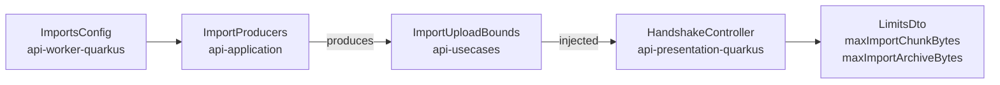

feat(api): the data states are declared and the handshake publishes the import bounds

## Context

The API serves export and import under `/api/v1/me/exports` and `/api/v1/me/imports`, and the web application calls none of it. The lot *the data travels* brings both to the account screen, with an import upload that survives a network cut and a reload. Its specification, `docs/specs/2026-09-25-the-data-travels.md`, rides in this pull request. This is the lot's only change under `api/`: the contract says what the client needs before any client code is written.

## Why

- **`state` is a plain `string`** on `UserDataExportOutputDto` and `UserDataImportOutputDto`. The client's behaviour hangs on it (whether to poll, which buttons to show, whether a download link exists), and an unknown state has no correct default. Typed `string`, nothing makes a screen handle every state.
- **The import's chunk size and archive bound are published nowhere.** `imports.max_chunk_bytes` (16 MiB) and `imports.max_archive_bytes` (20 GiB) live in `ImportsConfig` alone. A client that hard-coded them would drift from a deployment that lowers either.

## How

**Closed where behaviour depends on the value, open where only a sentence does** (decision I of the specification):

| Field | On the wire | Because |
|---|---|---|
| export and import `state` | closed `enum` | It drives behaviour. The client maps it through a `Record` keyed by the union, so a state it does not handle fails `pnpm run typecheck` |
| issue `kind`, `failureCode` | open `string`, unchanged | They drive a sentence with a correct fallback. A closed `kind` would make every new anomaly a contract major |

The states become presentation twins of the domain enums, `UserDataExportStateDto` and `UserDataImportStateDto`, mapped by an exhaustive `when`: the shape `DownloadStatusDto` already has. A domain state added later fails the build until its twin gains it, and `ContractSchemaDeclarationTest` holds the published enums to the domain's entries and `kind` to an open string.

**The contract goes to `18.0.0`.** `oasdiff` reads a response enum as closed, so declaring one is `response-property-enum-value-added` on every response carrying it. The alpha allows a major, and `contract/frozen/` is empty.

**The bounds reach the handshake without the presentation module reading `imports.*`.** `ImportsConfig` lives in `api-worker-quarkus`, which `api-presentation-quarkus` may not depend on. The composition root produces an `ImportUploadBounds` in `api-usecases`, the path `maxArchiveBytes` already takes to the chunk receiver. A second `@ConfigMapping` on `imports.*` in the presentation module would declare each default twice.

Both new `LimitsDto` fields are required. The pull request also files the backlog item the specification promised: the contract's other string fields, `reasonCode` and `DownloadStatusDto` included, weighed by the same test.

Block report, for the handoff

**Position.** Block 10 of lot `the-data-travels`, the bottom of the stack, base `main`; block 20 is next up. Carries the lot's specification. Consumers: block 20 (export section) reads the states first, block 30 (upload) the two bounds.

**Evidence**

- Gate: `dagger call gate` green at `699d7959`, 2 min 48 s, exit 0. The last commit, `eef0c88f`, only puts a comment back to its text on `main`.
- Continuous integration: run 36143519541, green, `verify` 7 min 40 s.
- Budget against `main`: 163 lines, 19 files.
- `contract-guard`: green at `18.0.0`; red at `17.1.0` with `api-major-version-not-bumped` (set to 17.1.0, regenerated, restored).
- Mutations: with the `17.0.0` contract restored, the states test fails (`expected: <[PENDING, READY, FAILED, EXPIRED, DELETED, SUPERSEDED]> but was: <[]>`); with an `enum` added to `kind`, the open-kind test fails.

**Departures from the plan**

- One client file changed, `clients/apps/webapp/src/lib/uploads.test.ts`: its `LIMITS` fixture is typed by the generated client, the two new `LimitsDto` fields are required, and the clients' typecheck refused it.
- `ImportUploadBounds` is a data class, not the value class the specification names: it holds two fields.
- A tier-1 fix left out for the budget's file bound: the comment on `ImportsConfig.maxChunkBytes` names the wrong test (`ImportsConfigIntegrationTest` instead of `BodyLimitCheck`). Fixing it made 20 files, so it is left to block 30.

**Tier-1 fixes**

- The `ImportProducers` KDoc said "The three import beans"; now "The import beans".

**Tier-2 questions**: none.

**Pitfalls**

- A required field added to a DTO breaks the clients' typed fixtures, not the Gradle build; only the full gate caught it.
- `gh stack submit --auto` titles the pull request after the branch and writes no body.

**Not verified**

- Whether the `pre-push` gate runs through `gh stack submit`: it did not show in that command's output.

🤖 Generated with [Claude Code](https://claude.com/claude-code)
