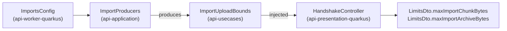

feat(api): the data states are declared, and the handshake publishes the import bounds

## Context

The API serves export and import (twelve operations under `/api/v1/me/exports` and `/api/v1/me/imports`), and the web application calls none of them yet. The lot `the-data-travels` puts both on `/account` and in the task centre, with an import upload that resumes after a cut or a reload. This pull request is its API side, the only one of the lot, and it carries the lot's specification (`docs/specs/2026-09-25-the-data-travels.md`).

## Why

Two things the client needs are missing from the contract:

- **The states are plain strings.** The client decides from `state` whether to poll, which buttons to show and whether a download link exists. With a `string`, TypeScript cannot tell it that it forgot a state.
- **The chunk size and the archive bound are published nowhere.** `imports.max_chunk_bytes` (16 MiB) and `imports.max_archive_bytes` (20 GiB) live in `ImportsConfig` only. A size hard-coded in the bundle would drift from a deployment that lowers the key.

## How

**One rule decides which strings close** (decision I): a value that drives behaviour has no safe default and is closed; a value that only picks a sentence has a fallback and stays open, so a new value is not a contract major.

| Field | Drives | On the wire |
|---|---|---|
| `UserDataExportOutputDto.state` | polling, buttons, link | `enum`, twin `UserDataExportStateDto` |
| `UserDataImportOutputDto.state` | polling, buttons, file picker | `enum`, twin `UserDataImportStateDto` |
| `UserDataImportIssueOutputDto.kind`, `failureCode` | a sentence | `string`, unchanged |

The twins follow `DownloadStatusDto`: presentation enums mapped by an exhaustive `when`, so a domain state added later fails the build rather than the client. The other string fields of the contract (`reasonCode`, `DownloadStatusDto` among them) are filed in the backlog to be weighed by the same rule.

**The bounds take the path `maxArchiveBytes` already takes to the chunk receiver.** `ImportsConfig` sits in the worker module, which the presentation module may not depend on (`ArchitectureKonsistTest`). A second `@ConfigMapping` on `imports.*` in presentation would declare each default twice. So the composition root copies the two values into a plain holder in `api-usecases`:

No module gains a dependency.

**The contract goes to `18.0.0`.** `oasdiff` reads a response enum as closed, so declaring the states is `response-property-enum-value-added` on every response that carries them. The alpha allows a major freely and `contract/frozen/` is empty.

**What pins it down:**

- one mapper test per twin walks every domain entry;
- `ContractSchemaDeclarationTest` requires both `state` enums to hold exactly the domain's values, and `kind` to stay an open `string`;
- `HandshakeIntegrationTest` overrides both `imports.*` keys in its profile, so defaults or constants would fail it.

Block report, for the handoff

**Position.** Block 10 of the lot `the-data-travels`, branch `feat/the-data-states-are-declared`, base `main`: the bottom of the stack of pull requests. Block 20 is next up. Consumers: block 20 is the first to read the states (the export section), and block 30 the first to read the two bounds (the upload).

**Evidence**

- Gate: `dagger call gate` green at `699d7959`, 2 min 48 s, exit 0. The last commit, `eef0c88f`, only restores a comment to its text on `main`.
- Continuous integration: run 36143519541, green, `verify` 7 min 40 s.
- Budget against `main`: 163 lines, 19 files.
- `contract-guard`: green at `18.0.0`. Red at `17.1.0` with `api-major-version-not-bumped` (checked by setting 17.1.0, regenerating, then restoring).
- Mutations: with the 17.0.0 contract restored, the states test fails (`expected: <[PENDING, READY, FAILED, EXPIRED, DELETED, SUPERSEDED]> but was: <[]>`). With an `enum` added to `kind`, the open-kind test fails.

**Departures from the plan**

- One client file changed, `clients/apps/webapp/src/lib/uploads.test.ts`. The generated client types its `LIMITS` fixture and the two new `LimitsDto` fields are required, so the clients' typecheck refused it.
- `ImportUploadBounds` is a data class, not the value class the specification names: it holds two fields.
- One tier-1 fix left out because of the file bound: the comment on `ImportsConfig.maxChunkBytes` names the wrong test (`ImportsConfigIntegrationTest` instead of `BodyLimitCheck`). Fixing it made 20 files, so it goes to block 30.

**Tier-1 fixes**

- The `ImportProducers` KDoc said "The three import beans"; it now says "The import beans".

**Tier-2 questions**: none.

**Pitfalls**

- A required field added to a DTO breaks the clients' typed fixtures, not the Gradle build. Only the full gate caught it.
- `gh stack submit --auto` titles the pull request after the branch and writes no body.

**Not verified**

- The pre-push gate did not show in `gh stack submit`'s output. Whether it runs through `gh stack` is not established.

🤖 Generated with [Claude Code](https://claude.com/claude-code)
