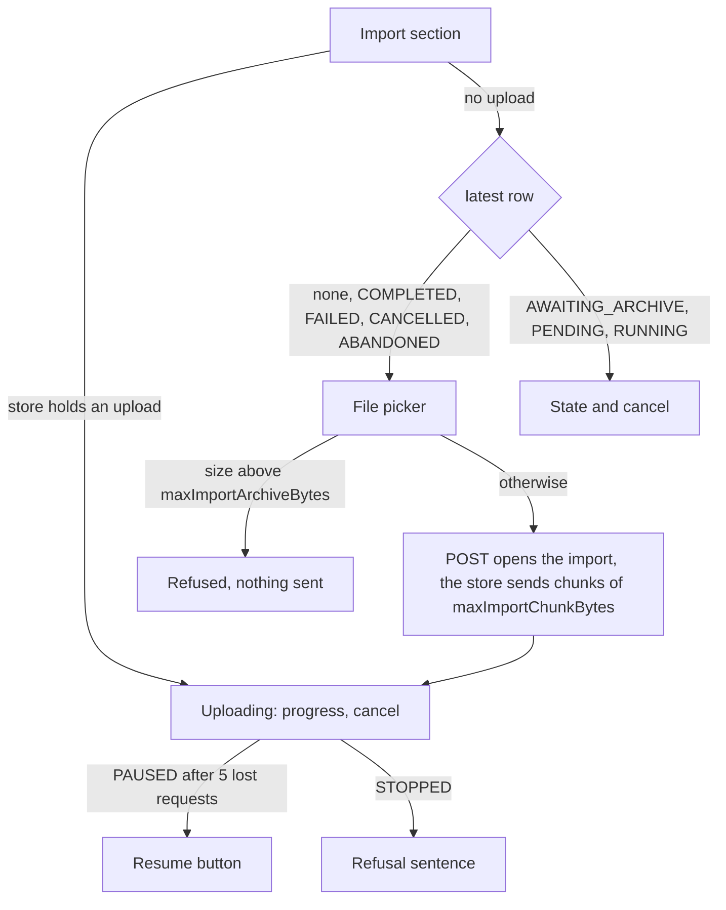

feat(webapp): the archive uploads from the account screen

## Context

The lot `the-data-travels` lets a signed-in user export their data and import an archive from `/account`, the
import's upload surviving a network cut, a change of screen and a reload. The upload store and the pure decisions
of its loop (`lib/imports.ts`) exist, and so does the Import section's read side: the latest import's state and its
cancel confirmation. Nothing yet lets a user choose a file, so the store has no caller.

## Why

This block puts the store in front of the user: the file picker, the upload's progress, its pause and resume after
lost requests, and the sentence when it stops. It closes the row of block 30 in the specification, which was split
in three once it measured 892 lines.

## How

The section reads two sources and the store wins: an upload this tab holds is shown whatever the server's row says,
because the row lags the bytes in flight. With no upload, the latest row picks the view, and every state that
leaves nothing to follow offers the picker again.

- **Both bounds come from the handshake**, so the picker stays disabled until it answers: a hard-coded chunk size
  would drift from a deployment that lowers `imports.max_chunk_bytes`.
- **The picker is a `<label>` styled with HeroUI's `buttonVariants`** around a visually hidden `<input type="file">`,
  HeroUI having no file control.
- **One table maps every reason an import stops to a sentence** (`importRefusal` in `dataRefusals.ts`): the refusal
  codes of the three operations, typed from the contract, plus the two the loop names itself (`CHUNK_TOO_LARGE` for
  a proxy's bodyless `413`, `ARCHIVE_LONGER_THAN_FILE`). An unknown code gets the general sentence; the `hasOwn`
  guard the export's table used becomes generic over both tables.

The journey `import an archive` gains the cases block 30 declared, against a handshake publishing a 4-byte chunk
and a 10-byte archive:

| Case | What it pins |
|---|---|
| Nominal | `PUT`s at 0, 4, 8 as `application/octet-stream` with the right slices, then one `complete` |
| Lost request, then a `409` at `currentLength` 6 | the retry reuses the offset; the next `PUT` starts at 6, not 4 or 8 |
| `currentLength` 12 | the upload stops with its sentence, no `complete`, the page no longer held |
| Five lost requests | the upload pauses; resume sends the next `PUT` and it finishes |
| File above the bound | the sentence, and no request at all |
| Navigate to `/` mid-upload | the chunk at 8 leaves with the section unmounted; `beforeunload` held until the end |

Block report, for the handoff

**Position.** Block 37 of the lot `the-data-travels`, the last of the three blocks block 30 was split into (30, 34,
37) after it measured 892 lines; operator's answer "b", 2026-09-25. Stacked on #223 (block 34,
`feat/the-import-is-followed`), itself on #222 (block 30: the upload store and its pure decisions). Next up: block 40,
resuming after a reload.

**Evidence.**
- Gate: `dagger call gate` green at `08412ddd`, exit 0.
- Continuous integration: run 36149285625, green, `verify` 6 min 41 s.
- Budget against `feat/the-import-is-followed`: 367 lines, 7 files.
- Headless reading: Firefox over WebDriver BiDi, the bundle served against a stubbed API that cuts sockets or answers
  `507` on demand, at 1280 and 380 px: uploading at 52 %, the cancel confirmation during an upload, paused after the
  five attempts (23 s real), stopped by a `507`, a 60 MB file against a 50 MB bound. No horizontal overflow; nothing
  needed fixing.

**Departures from the plan.** This block is the rest of block 30's row after block 34's cancel case. The three blocks
together differ from the single 892-line block only by #223's two display fixes and this journey's `openTheAccount`
helper taking its `answer` as an option.

**Tier-1 fixes.** None.

**Tier-2 questions.** The split of block 30 in three, carried by #222; answered "b" by the operator on 2026-09-25.

**Pitfalls.**
- jsdom's `Blob` does not survive Node's `fetch`: a slice of a jsdom `File` reaches MSW as the text `"undefined"`, so
  the journey builds its archive with `node:buffer`'s `File`. The browser is unaffected.
- The retry wait is real time, so the journeys use fake timers with `shouldAdvanceTime` and advance by `RETRY_MS`.
- A stopped upload leaves the import `AWAITING_ARCHIVE` on the server; the section then offers cancel and no picker.
  Block 40 adds resuming with the same file.

**Not verified.** Whether one `PUT` at a time with a 5-second wait suffices against a half-open connection
(specification, section 9).

🤖 Generated with [Claude Code](https://claude.com/claude-code)
