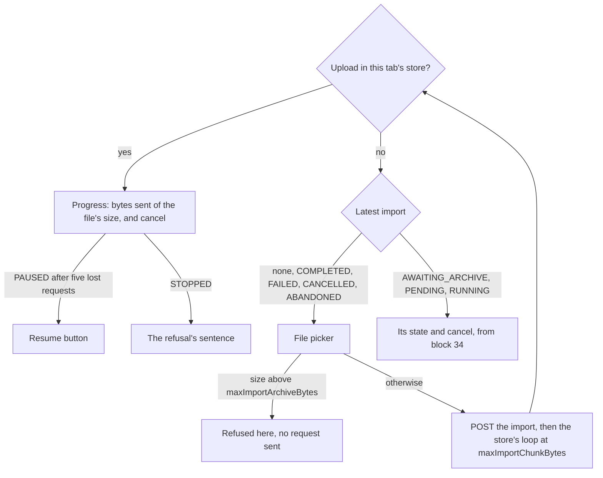

feat(webapp): the archive uploads from the account screen

## Context

The lot *the data travels* brings the API's import and export to the web application. Block 30 built the upload itself: a module-level store (`imports.ts`) that runs above the router, and the pure decisions of its chunk loop (`lib/imports.ts`). Block 34 gave the account screen's import section its read side: the latest import's state and the cancel confirmation. Nothing yet let a user choose a file, so the store had no caller.

## Why

This block closes the specification's block 30 row: a user picks an archive, watches it leave in chunks, and is told in a sentence why it paused or stopped. The chunk size and the archive bound come from the handshake (decision I'), so a deployment that lowers `imports.max_chunk_bytes` is followed without a new bundle.

## How

The section decides what to show in one place. An upload held by this tab's store wins over the server's row, because the store outlives the screen: leave `/account` mid-upload, come back, and the progress bar is where the loop is.

- **The picker waits for the handshake.** It stays disabled until the limits are known, so a file is never cut at a guessed chunk size, and a file past the bound is refused before an import is even opened.
- **Refusals become sentences through one table**, `importRefusal` in `dataRefusals.ts`, beside the export's. Its keys are the refusal codes the contract declares for the three upload operations, plus the two codes the loop names itself: `CHUNK_TOO_LARGE` (a reverse proxy's bodyless `413`) and `ARCHIVE_LONGER_THAN_FILE` (the server holds more than the file has). `satisfies Partial<Record<…>>` makes a misspelt key a typecheck failure; an unknown code gets the general sentence, and `Object.hasOwn` keeps `constructor` from answering.
- **The file picker is a native `<input type="file">`** inside a label styled with HeroUI's `buttonVariants`, HeroUI having no file control.

What the journey *import an archive* now proves, against a 4-byte chunk and a 10-byte archive:

| Case | Fails if |
|---|---|
| Three slices, then `complete` | offsets, bodies or `Content-Type: application/octet-stream` are wrong |
| A lost request, then a `409` with `currentLength` 6 | the retry does not reconcile, or resumes at 4 or 8 instead of 6 |
| A `409` with `currentLength` 12 | the upload goes on, sends `complete`, or still holds the page |
| Five lost requests | the upload does not pause, or resume does not restart it |
| A file past the bound | any request leaves |
| Leaving the screen mid-upload | a chunk stops leaving while `/account` is unmounted, or `beforeunload` is not held then released |

Block report, for the handoff

**Position.** Block 37 of the lot `the-data-travels`, branch `feat/the-archive-uploads`: the last of the three blocks block 30 was split into (30, 34, 37) after block 30 measured 892 lines over 17 files; operator's answer "b", 2026-09-25. Stacked on #223 (block 34, `feat/the-import-is-followed`), itself stacked on #222 (block 30, the upload store and its pure decisions). The next block up is 40, resuming after a reload.

**Evidence.**
- Gate: `dagger call gate` green at `08412ddd`, exit 0.
- Continuous integration: run 36149285625, green, `verify` 6 min 41 s.
- Budget against `feat/the-import-is-followed`: 367 lines, 7 files.
- Headless reading: Firefox over WebDriver BiDi, the bundle served against a stubbed API that cuts sockets or answers `507` on demand, at 1280 and 380 px. Seen: uploading at 52 %, the cancel confirmation during an upload, paused after the five attempts (23 s real), stopped by a `507`, a 60 MB file against a 50 MB bound. No horizontal overflow; nothing needed fixing.

**Departures from the plan.**
- This block is the rest of block 30's row after block 34's cancel case: the file picker, the upload view and the journey's upload cases.
- The three blocks together differ from the single 892-line block only by #223's two display fixes and this journey's `openTheAccount` helper taking its `answer` as an option.

**Tier-1 fixes.** None.

**Tier-2 questions.** The split of block 30 in three, answered "b" by the operator on 2026-09-25, carried by #222.

**Pitfalls.**
- jsdom's `Blob` does not survive Node's `fetch`: a slice of a jsdom `File` reaches MSW as the text `"undefined"`, so the journey builds its archive with `node:buffer`'s `File`. The browser is unaffected.
- The retry wait is real time, so the timer journeys use fake timers with `shouldAdvanceTime` and advance by `RETRY_MS`.
- A stopped upload leaves the import `AWAITING_ARCHIVE` on the server; the section then offers cancel and no picker. Block 40 adds resuming with the same file.

**Not verified.** Whether one `PUT` at a time with a 5-second wait suffices against a half-open connection (specification, section 9), nor what the import makes of an archive corrupted that way.

🤖 Generated with [Claude Code](https://claude.com/claude-code)
