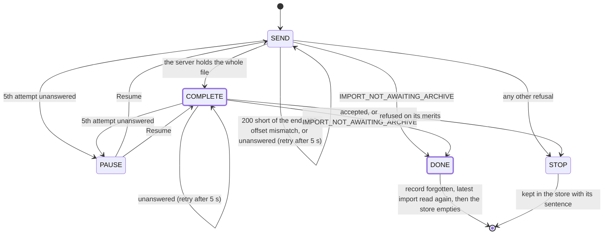

fix(webapp): the data travels closes, the holistic review's findings

## Context

The closing block of the lot `the-data-travels` (export and import from the account screen, with a resumable upload). The holistic review ran over the whole lot before any of its pull requests merged, at the operator's request, and found 1 MAJOR and 11 MINOR. This block answers them and corrects the lot's handoff, backlog and specification.

## Why

The upload loop treated its last request, the close (`POST .../archive/complete`), as fire-once, and treated `IMPORT_NOT_AWAITING_ARCHIVE` as a refusal. Both left a stopped upload in the store, and the store outranks the server's row in the Import section and in the task centre:

| Situation | Before | Now |
|---|---|---|
| The close arrives, its answer is lost | Upload stopped; the only control is Cancel, which `DELETE`s an import already `PENDING` or `RUNNING` (the MAJOR) | The close is retried on the chunks' schedule; the retry's `409` hands over to the server's row |
| Another tab closed the upload first | Same as above | The losing tab shows the server's import |
| The close succeeds | "The upload of pinry.zip stopped before the end" for one round trip | The server's row replaces the upload with no frame in between |
| A cancel is refused mid-upload | Silent: the upload was dropped before the `DELETE`, unmounting the view that held the error | The refusal shows and the upload goes on |
| A read of the latest import is in flight when a new one opens | It could delete the new import's resume record | The tab's own upload's record is never pruned |

## How

All of it lives in the upload store (`imports.ts`) and the pure step function under `src/lib/`, inside the 100 % coverage bound. The close becomes an attempt like a chunk, and the loop gains a terminal `DONE`: the server has the archive, whoever closed it.

Two ordering rules carry the minor fixes: on `DONE` the store empties only once the latest import has been read again, and a cancel drops the upload only once its `DELETE` has succeeded and the row has been read again.

`IMPORT_NOT_AWAITING_ARCHIVE` no longer stops an upload, so its sentence leaves both catalogues. The rest is hygiene the review asked for: journey row fixtures typed by the contract, list routes made redundant by the default handlers removed, a journey case for a refused opening, catalogue formatting, comments no longer citing "decision D1" without its document, and a KDoc on `maxImportArchiveBytes`.

Block report, for the handoff

**Position.** Closing block of `the-data-travels`, `fix/the-data-travels-closes` stacked on #228 (block 65), at the top of a stack of ten pull requests, none merged. The holistic review, `.reviews/the-data-travels-holistic.md` (not committed), ran on the top of the stack before any merge and before the operator's reading.

**Evidence.**
- Gate: `dagger call gate` green at `6de14f7b`, exit 0; clients 55 files, 280 tests; `src/lib` coverage 100 % of lines and branches.
- Continuous integration: run 36160705746, green, `verify` 7 min 49 s.
- Budget against `feat/the-task-centre-keeps-data-notices`: 278 lines, 18 files.
- Red before the fix: the three new behaviour cases (the flash, the lost close, the refused cancel) failed against the unfixed store. The refused-opening case passed already: a coverage gap, not a defect.
- Headless reading (Firefox, stubbed API, 1280 and 380 px, the section's text sampled every 25 ms): the success goes from 100 % straight to "The archive is waiting to be imported." with no frame of the reload sentence; with every close cut for a second, the section holds at 100 %, sends the close again 5 s later, and the `409` hands over to the pending import; a refused cancel shows "That could not be done. Try again in a moment." under the running progress bar. No horizontal overflow at 380 px.

**Departures from the plan.**
- Wrap ran before the merges: the holistic review read `origin/feat/the-task-centre-keeps-data-notices` in place of `origin/main`, at the operator's request ("Lance la revue holistique avant que je relise").
- The `ImportsConfig` finding is kept, not fixed: `eef0c88f` took the comment out of block 10 to stay under the file bound and `ddabed5a` (#222) carried it back; recorded in the handoff.

**Tier-1 fixes (the holistic review's findings).**
- MAJOR: a stopped upload outranked the server's row with Cancel as its only control; a lost close turned into a stop while the import could be `PENDING` or `RUNNING`, and Cancel would `DELETE` it; the losing tab of the two-tabs case likewise. Fixed: the close is retried; `IMPORT_NOT_AWAITING_ARCHIVE` to a chunk or the close gives way to the server's row.
- MINOR, fixed: the success flash; the silent refused cancel; the record deleted by a read begun before its import opened; untyped row fixtures; redundant empty list routes (the three journeys named, and four data journeys carrying the same); no test for a refused opening; catalogue formatting churn; comments citing a decision or section without its document; three contradictions in the specification (Branches header, section 5, section 6); no KDoc on `maxImportArchiveBytes`.
- MINOR, kept: `ImportsConfig`'s comment in a web application block.
- Two findings were partly wrong: #222's 264 lines do count the `ImportsConfig` comment (2 lines, 1 file), and `maxFileBytes` and `maxPixels` carry no KDoc either.

**Tier-2 questions.** None in this block. Recorded here from earlier: "Q1", two tabs uploading one import is an accepted known limit with no guard; `docs/backlog.md` now points to it from Known limits.

**Pitfalls.**
- Firefox resends a `POST` cut on a reused connection by itself, up to four times within the same millisecond: a stub that cuts only the first close tests the browser's retry, not the application's.

**Not verified, or left to fill.**
- The screens were read headless against a stubbed API, never against the running API.
- Two tabs on one import remain unguarded (accepted, above).
- The handoff's merge figures (wall-clock time, review latency, cascaded rebases) and the operator's reading of the stack experiment exist only after the merges, and are to be filled before this block merges and the handoff freezes.

🤖 Generated with [Claude Code](https://claude.com/claude-code)
