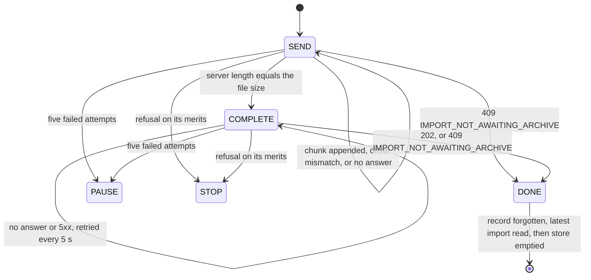

fix(webapp): the data travels closes on the holistic review's findings

## Context

This is the closing block of the lot `the-data-travels`. It sits on #228 at the top of a stack of ten pull requests, none of them merged yet. At the operator's request, the holistic review ran on the top of the stack before any merge and found 1 MAJOR and 11 MINOR. This pull request fixes them. It also corrects the handoff, reconciles the backlog and resolves three contradictions in the specification. The experiment's merge figures and the operator's own reading can only be written after the review, so they stay blank.

## Why

While the upload store holds an upload, the import section and the Tasks centre show that upload instead of the server's latest import. Two outcomes left a *stopped* upload in the store for the rest of the tab's life, with Cancel as its only control (the MAJOR):

- **A close whose answer was lost.** The request `POST .../archive/complete` reached the server but its answer never came back, and the client read that as a stop. On the server the import could already be `PENDING` or `RUNNING`, so pressing Cancel would `DELETE` a live import.
- **The losing tab of two tabs uploading one import.** It stopped on `IMPORT_NOT_AWAITING_ARCHIVE` and was left in the same position.

Three MINOR defects came from the same moment, when the upload leaves the store:

- A successful upload briefly showed "stopped before the end": the store was emptied before the latest import was read again.
- A refused cancel showed nothing: the store was emptied before the `DELETE`, and that unmounted the component holding the mutation.
- A read of the latest import that started before the import opened could delete the new resume record.

## How

The loop's decisions stay a pure function in `lib/imports.ts`. The close now counts as one more attempt, retried on the same schedule as a chunk. A new outcome, `DONE`, means "the server has moved on, read its row":

The store now follows one rule: **an upload leaves the store only after the server's row that replaces it has been read.**

| Moment | Before | After |
|---|---|---|
| Close accepted, or import no longer awaiting its archive | stop, or store emptied, then the latest import read in the background | record forgotten, latest import read, then store emptied |
| Cancel | store emptied, then `DELETE` | `DELETE`, latest import read, and the store emptied only if the `DELETE` succeeded |
| Pruning the resume records | keeps the latest import's record if it is `AWAITING_ARCHIVE` | also keeps the record of this tab's own upload |

`IMPORT_NOT_AWAITING_ARCHIVE` no longer stops an upload, so its sentence is removed from both message catalogues. Two tabs uploading one import stays a known limit with no guard, as the operator accepted ("Q1"). The losing tab now shows the server's import rather than a Cancel over it, and `docs/backlog.md` points to that limit under Known limits.

The MINOR findings on the tests and on tidying are also fixed. Those are the typed row fixtures, the redundant list routes, the refused-opening case, catalogue formatting, comments that cite a decision without naming the document, and a KDoc. The `ImportsConfig` finding is kept, with the reason in the report below.

Block report, for the handoff

**Evidence**

- Gate: `dagger call gate` green at `6de14f7b`, exit 0. Clients: 55 files, 280 tests. `src/lib` coverage: 100 % of lines and branches.
- Continuous integration: run 36160705746, green, `verify` 7 min 49 s.
- Budget against `feat/the-task-centre-keeps-data-notices`: 278 lines, 18 files.
- Red before the fix: the three new behaviour cases (the flash, the lost close, the refused cancel) failed against the unfixed store. The refused-opening case already passed, which makes it a coverage gap and not a defect.
- Headless reading (Firefox, stubbed API, 1280 and 380 px, the section's text sampled every 25 ms):
  - A success goes from 100 % straight to "The archive is waiting to be imported." and no frame shows the reload sentence.
  - With every close cut for one second, the section stays at 100 %, sends the close again 5 s later, and the 409 then hands over to the pending import.
  - A refused cancel shows "That could not be done. Try again in a moment." under the running progress bar.
  - No horizontal overflow at 380 px.

**The holistic review** (`.reviews/the-data-travels-holistic.md`, not committed; 1 MAJOR, 11 MINOR)

| Severity | Finding | Exit |
|---|---|---|
| MAJOR | A stopped upload outranked the server's row, with Cancel as its only control. A lost close turned into a stop. The losing tab of two had the same problem | Fixed. Journey case: a close whose answer is lost |
| MINOR | "The upload of pinry.zip stopped before the end" flashed for one round trip after a success | Fixed. The first upload journey asserts the sentence never shows |
| MINOR | A cancel refused from the upload view was silent | Fixed. Journey case: a cancel refused during an upload |
| MINOR | A read already in flight (window refocus as the file dialog closes) could delete the new import's resume record | Fixed |
| MINOR | An API comment change (`ImportsConfig`) arrived in a web application block | Kept and recorded in the handoff: `eef0c88f` moved it out of block 10 to stay under the file bound, and `ddabed5a` (#222) brought it back |
| MINOR | The journeys' row fixtures accepted any string as a state | Fixed: typed by the contract |
| MINOR | Empty list routes were left redundant by block 60's default handlers | Fixed: removed from the three journeys named, and from the four data journeys that had the same routes |
| MINOR | No test for a refused opening of an import | Fixed |
| MINOR | Formatting churn in the message catalogues | Fixed |
| MINOR | Comments cited "decision D1" or "section 2" without naming the document | Fixed: the references are dropped |
| MINOR | The specification contradicted its own corrections | Fixed: three `(Corrected: ...)` entries (the header, section 5, section 6) |
| MINOR | `maxImportArchiveBytes` had no KDoc | Fixed |

Two findings were partly wrong. #222's 264 lines do count the `ImportsConfig` comment (2 lines, 1 file). And `maxFileBytes` and `maxPixels` carry no KDoc either.

**Departures from the plan**

- Wrap ran before the merges. The holistic review read `origin/feat/the-task-centre-keeps-data-notices` in place of `origin/main`, at the operator's request ("Lance la revue holistique avant que je relise").
- The `ImportsConfig` finding is kept, not fixed.
- The handoff's merge figures (wall-clock time, review latency, cascaded runs) and the operator's reading are still to be filled, after the review and before this pull request merges.

**Tier-1 fixes:** none recorded for this block beyond the findings above.

**Tier-2 questions:** none in this block. The two-tabs text rests on the operator's earlier answer "Q1": an accepted known limit with no guard.

**Pitfalls**

- On a reused connection, Firefox resends a cut `POST` on its own, up to four times within the same millisecond. A stub that cuts only the first close is testing the browser's retry, not the application's. Cut every close for a period of time instead.

**Not verified**

- The screens were read headless against a stubbed API, never against the running API.
- Two tabs on one import: no guard, by the operator's decision.

🤖 Generated with [Claude Code](https://claude.com/claude-code)
