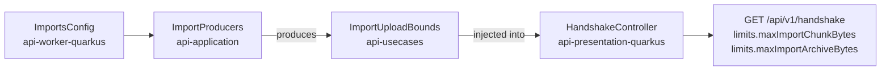

feat(api): the data states are declared and the import bounds published

## Context

The lot *the data travels* brings export and import to the web application's account screen: twelve operations
under `/api/v1/me/exports` and `/api/v1/me/imports` that no client calls yet. This is the only block of the lot that
touches `api/`; the web application builds on the contract it leaves. It also carries the lot's specification,
`docs/specs/2026-09-25-the-data-travels.md`.

## Why

The client needs two things the contract does not say today.

**Which states exist.** Both `state` fields are plain strings, yet the client's behaviour hangs on them: whether to
poll, which buttons to show, whether a download link exists. An unknown state has no correct default, so the contract
should promise the whole set. Not every string field deserves that; what decides is what the client does with it.

| Field | The client uses it to | Faced with an unknown value | Published as |
|---|---|---|---|
| export and import `state` | poll, pick the buttons, show a link | has no correct default | closed `enum` |
| issue `kind`, `failureCode` | pick a sentence | falls back to a general one | open `string` |

Closing `kind` would make every new anomaly a contract major, and after beta each served major is a frozen document
to keep serving. On the client, the generated union lets a `Record` keyed by the state fail `pnpm run typecheck` on
a state left unhandled.

**How to upload.** An archive is sent in chunks, but `imports.max_chunk_bytes` (16 MiB) and
`imports.max_archive_bytes` (20 GiB) are published nowhere. A chunk size hard-coded in the bundle would drift from a
deployment that lowers the key, so the handshake's `LimitsDto` gains `maxImportChunkBytes` and
`maxImportArchiveBytes`, beside the image limits it already publishes.

## How

**The states** get presentation twins of the domain enums, the shape `DownloadStatusDto` already has. The mappers
convert with an exhaustive `when`, so a domain state added later fails the build instead of reaching the wire
unannounced; a contract test pins each published `enum` to the domain's entries, and `kind` to an open string.

**The bounds** live in `ImportsConfig`, in the worker module, which the presentation module may not depend on. The
composition root copies them into a plain value, the path `maxArchiveBytes` already takes to the chunk receiver:

A second `@ConfigMapping` on `imports.*` in the presentation module was the alternative; it would declare each
default twice.

**The version.** `oasdiff` reads a response enum as closed, so declaring the states is
`response-property-enum-value-added` on every response that carries them: the contract goes from `17.0.0` to
`18.0.0`. The alpha allows the major, and `contract/frozen/` is empty. The two new `LimitsDto` fields are required,
which is why one web application test fixture changes.

`docs/backlog.md` gains one item: the contract's other string fields, `reasonCode` and `DownloadStatusDto` included,
weighed by the same test.

Block report, for the handoff

**Evidence**

- Gate: `dagger call gate` green at 699d7959, 2 min 48 s, exit 0. The last commit, eef0c88f, only puts a comment back
  to its text on `main`.
- Continuous integration: run 36143519541, green, `verify` 7 min 40 s.
- Budget against `main`: 163 lines, 19 files.
- `contract-guard`: green at `18.0.0`; red at `17.1.0` with `api-major-version-not-bumped` (set to 17.1.0,
  regenerated, then restored).
- Mutations: with the 17.0.0 contract restored, the states test fails
  (`expected: <[PENDING, READY, FAILED, EXPIRED, DELETED, SUPERSEDED]> but was: <[]>`); with an `enum` added to
  `kind`, the open-kind test fails.

**Departures from the plan**

- One client file changed, `clients/apps/webapp/src/lib/uploads.test.ts`: its `LIMITS` fixture is typed by the
  generated client and the two new `LimitsDto` fields are required, so the clients' typecheck refused it.
- `ImportUploadBounds` is a data class, not the value class the specification names: it holds two fields.
- A tier-1 fix left out for the file bound: the comment on `ImportsConfig.maxChunkBytes` names the wrong test
  (`ImportsConfigIntegrationTest` instead of `BodyLimitCheck`); fixing it made 20 files, so it is left to block 30.

**Tier-1 fixes**

- The `ImportProducers` KDoc said "The three import beans"; now "The import beans".

**Tier-2 questions**: none.

**Pitfalls**

- A required field added to a DTO breaks the clients' typed fixtures, not the Gradle build; only the full gate
  caught it.
- `gh stack submit --auto` titles the pull request after the branch and writes no body.

**Not verified**

- The pre-push gate did not show in `gh stack submit`'s output; whether it runs through `gh stack` is not
  established.

**Consumers**: the states are first read by block 20 (export section), the two bounds by block 30 (upload).

🤖 Generated with [Claude Code](https://claude.com/claude-code)
