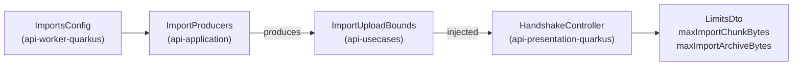

feat(api): the data states are declared and the handshake publishes the import bounds

The lot *the data travels* brings export and import to the web application's account screen: request and download an export, and upload an archive in resumable chunks. The API already serves all twelve operations; the web application calls none. This block, the bottom of the stack, is the API side alone: what the contract must say before a client can be written against it. It also carries the lot's specification (`docs/specs/2026-09-25-the-data-travels.md`) and files one backlog item.

## Why

Two things the client needs are missing from the contract.

- **The export's and the import's `state` are plain strings**, yet the client's behaviour hangs on them: whether to poll, which buttons to show, whether a download link exists. An unknown state has no correct default, so it has to be a closed set the client can map exhaustively (a `Record` keyed by the enum's union fails `typecheck` on a missed state).
- **The chunk size and the archive bound are published nowhere.** They live in `imports.*`, yet the client must cut chunks at the first and refuse a file past the second before opening an import. Hard-coding them in the bundle drifts from any deployment that changes the keys.

## How

The rule for closing a field is what the client does with the value:

| Field | Drives | On the wire |
|---|---|---|
| export `state` (6 values), import `state` (7 values) | behaviour | closed: `enum`, presentation twins of the domain enums, the shape `DownloadStatusDto` already has |
| issue `kind`, `failureCode` | a sentence, with a general fallback | stay open `string`: a closed `kind` would make every new anomaly a contract major |

The twins are mapped from the domain with an exhaustive `when`, so a domain state added later fails the build. A contract test ties each published enum to the domain's entries and pins `kind` as an open string.

The bounds cannot be read where the handshake lives: `ImportsConfig` belongs to the worker module, which the presentation module may not depend on. They take the path `maxArchiveBytes` already takes to the chunk receiver, through `api-application`, so no module gains a dependency:

A second `@ConfigMapping` on `imports.*` in the presentation module was the alternative; it would declare each default twice.

**The contract goes to `18.0.0`.** `oasdiff` reads a response enum as closed, so declaring the states is `response-property-enum-value-added` on every response that carries them: a major. The alpha allows it and `contract/frozen/` is empty. The two new `LimitsDto` fields are required.

**The backlog item** filed at the operator's request: the contract's other string fields (`reasonCode`, `DownloadStatusDto` included) weighed by the same test.

Next up the stack, block 20 (the export section) is the first to read the states, and block 30 (the upload) the first to read the bounds.

Block report, for the handoff

**Evidence**

- Gate: `dagger call gate` green at `699d7959`, 2 min 48 s, exit 0. The last commit, `eef0c88f`, only restores a comment to its text on `main`.
- Continuous integration: run 36143519541, green, `verify` 7 min 40 s.
- Budget against `main`: 163 lines, 19 files.
- `contract-guard`: green at `18.0.0`; red at `17.1.0` with `api-major-version-not-bumped` (set to 17.1.0, regenerated, restored).
- Mutations: with the 17.0.0 contract restored, the states test fails (`expected: <[PENDING, READY, FAILED, EXPIRED, DELETED, SUPERSEDED]> but was: <[]>`); with an `enum` added to `kind`, the open-kind test fails.
- The handshake integration test overrides `imports.max_chunk_bytes` and `imports.max_archive_bytes` in its profile, so it discriminates from the defaults.

**Departures from the plan**

- One client file changed, `clients/apps/webapp/src/lib/uploads.test.ts`: its `LIMITS` fixture is typed by the generated client and the two new `LimitsDto` fields are required, so the clients' typecheck refused it.
- `ImportUploadBounds` is a data class, not the value class the specification named: it holds two fields.
- A tier-1 fix left out for the file bound: the comment on `ImportsConfig.maxChunkBytes` names the wrong test (`ImportsConfigIntegrationTest` instead of `BodyLimitCheck`). Fixing it made 20 files, so it goes to block 30.

**Tier-1 fixes**

- The `ImportProducers` KDoc said "The three import beans"; now "The import beans".

**Tier-2 questions**: none.

**Pitfalls**

- A required field added to a DTO breaks the clients' typed fixtures, not the Gradle build; only the full gate caught it.
- `gh stack submit --auto` titles the pull request after the branch and writes no body.
- The pre-push gate did not show in `gh stack submit`'s output.

**Not verified**

- Whether the pre-push gate runs at all through `gh stack submit`.

**Stack**: block 10 of `the-data-travels`, base `main`; block 20 is next. The states are first read by block 20 (export section), the two bounds by block 30 (upload).

🤖 Generated with [Claude Code](https://claude.com/claude-code)
