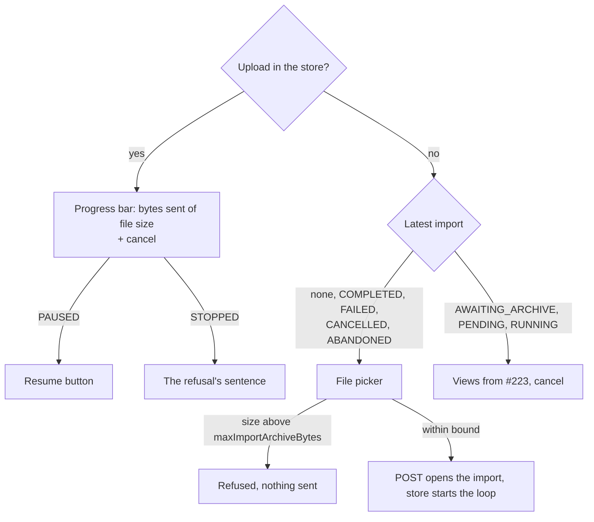

feat(webapp): the archive uploads from the account screen

## Context

The lot `the-data-travels` brings export and import to `/account`. An import is opened by `POST`, fed by `PUT .../archive?offset=` chunks and closed by `POST .../complete`; the handshake now publishes the chunk size and the archive bound. The blocks below this one laid down the upload store, a module-level store above the router with the loop's decisions as a pure function in `lib/imports.ts` (#222), and the section's read side with the cancel confirmation (#223). Nothing let a user start an upload yet.

## Why

The store had no consumer: no file picker, no view of an upload in flight, no sentence for why one stopped. This block is that consumer, and its journey is the first test that drives the whole loop through the real section, the store and `fetch`, against a server that cuts, refuses and lies about offsets.

## How

The section chooses between two sources: the upload this tab holds, which outlives the screen, and the latest import the server reports. The tab's upload wins while it exists.

- **The bound is checked before anything is opened.** The picker stays disabled until the handshake answers, so the chunk size is never guessed and a file too large leaves no import behind.
- **Views stay keyed by the state enum** (`Record<Import["state"], ...>`), so a state added to the contract fails `typecheck`; the terminal states now each offer the picker.
- **Refusals are an open set**: one table from code to sentence, with the general sentence for a code this bundle does not know. It covers the three import operations' codes plus the two the loop names itself: `CHUNK_TOO_LARGE` (a proxy's bodyless `413`) and `ARCHIVE_LONGER_THAN_FILE` (the server holds more than the file, so it is not the same file). The export's lookup is generalised to take its table, rather than copied.

What the journey pins, with a 4-byte chunk and a 10-byte archive:

| Server behaviour | What the client does |
|---|---|
| Every chunk appended | `PUT`s at 0, 4, 8 as `application/octet-stream`, then one `complete` |
| A lost request, then a `409` with `currentLength` 6 at offset 4 | Retries 0, then resumes at 6, not 4 or 8 |
| A `409` with `currentLength` 12 | Stops with its sentence, never sends `complete`, releases the page |
| Five lost requests in a row | Pauses behind "Resume the upload", which carries on from 0 |
| A file past the bound | Refused before any request |
| Navigating to `/` mid-upload | A chunk leaves while the section is unmounted; the page asks before unload until the upload ends |

Block report, for the handoff

**Position.** Block 37 of `the-data-travels`, branch `feat/the-archive-uploads`, the last of the three blocks block 30 was split into (30, 34, 37). Stacked on #223 (block 34, `feat/the-import-is-followed`), itself on #222 (block 30). Next up: block 40, resuming after a reload.

**Evidence.**
- Gate: `dagger call gate` green at `08412ddd`, exit 0.
- Continuous integration: run 36149285625, green, `verify` 6 min 41 s.
- Budget against `feat/the-import-is-followed`: 367 lines, 7 files.
- Headless reading: Firefox over WebDriver BiDi, the bundle served against a stubbed API that cuts sockets or answers `507` on demand, at 1280 and 380 px. Seen: uploading at 52 %, the cancel confirmation during an upload, paused after the five attempts (23 s real), stopped by a `507`, a 60 MB file against a 50 MB bound. No horizontal overflow; nothing needed fixing.

**Departures from the plan.**
- Block 30 measured 892 lines over 17 files; the operator answered "b" on 2026-09-25 and it became three blocks. This one is the rest of block 30's row after 34's cancel case: the file picker, the upload view and the journey's upload cases.
- The three blocks together differ from the single 892-line block only by #223's two display fixes and this journey's `openTheAccount` taking its `answer` as an option.

**Tier-1 fixes.** None.

**Tier-2 questions.** The split above, carried by #222.

**Pitfalls.**
- jsdom's `Blob` does not survive Node's `fetch`: a slice of a jsdom `File` reaches MSW as the text "undefined", so the journey builds its archive with `node:buffer`'s `File`. The browser is unaffected.
- The retry wait is real time, so the journeys use fake timers with `shouldAdvanceTime` and advance by `RETRY_MS`.
- A stopped upload leaves the import `AWAITING_ARCHIVE` on the server; after a reload the section offers cancel and no picker. Block 40 adds resuming with the same file.

**Not verified.** Whether one `PUT` at a time with a 5-second wait suffices against a half-open connection (specification, section 9): the server's append takes no lock, so two appends on one file stay possible in principle.

🤖 Generated with [Claude Code](https://claude.com/claude-code)
