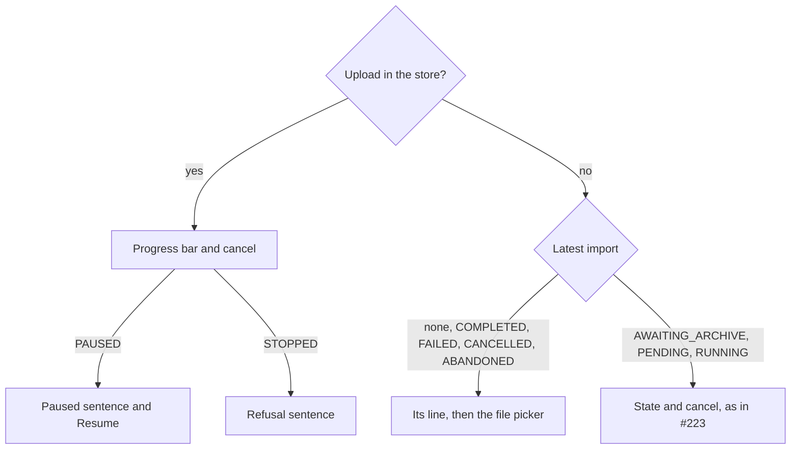

feat(webapp): the archive uploads

## Context

The lot *the data travels* gives the account screen an import whose upload survives a network cut and a change of screen. #222 built the upload store, which lives above the router and runs one chunk `PUT` at a time, and the pure function in `lib/imports.ts` that decides each step (append, reconcile on `409`, retry, pause, stop). #223 gave the Import section its read side: the latest import, its state, and cancel behind a confirmation.

## Why

Nothing called the store yet, so a user still could not start an import. This block is its consumer: the file picker, the upload's view, a sentence for each way an upload stops, and the journey that drives the whole loop through the screen. It is the last third of block 30, which was split in three when it measured 892 lines.

## How

The section reads two sources, in this order: the upload this tab holds, which outlives the screen, then the server's latest import.

- **The picker waits for the handshake**, which publishes the chunk size and the archive bound (block 10). A file past the bound is refused in the browser, before any import is opened.
- **Refusals become sentences with a fallback**, as the export's already do. One table covers the codes the contract declares for opening, appending and completing an import, plus the two the loop names itself: `CHUNK_TOO_LARGE` (a proxy's bodyless `413`) and `ARCHIVE_LONGER_THAN_FILE` (the server holds more bytes than the file has). An unknown code gets the general sentence. The export and import lookups now share one `Object.hasOwn` guard.
- **The journey drives the real store against a mocked API**, with 4-byte chunks and a 10-byte archive `0123456789`:

| The server answers | The journey sees |
|---|---|
| every chunk appended | `PUT`s at 0, 4, 8 carrying `0123`, `4567`, `89`, then one `complete` |
| a lost request, then `409` with `currentLength` 6 on the chunk at 4 | offsets 0, 0, 4, 6, the last carrying `6789` |
| `409` with `currentLength` 12 | the "not the same file" sentence, no `complete`, the page no longer held on close |
| five lost requests in a row | paused behind Resume; pressing it finishes the upload |
| nothing: the bound is 9 bytes | the "too large" sentence, and no request at all |
| a chunk in flight, the user goes to `/` and back | the chunk at 8 left while the section was unmounted; progress reads 8; closing the tab is held until the upload ends |

Block report, for the handoff

**Position.** Block 37 of the lot `the-data-travels`, branch `feat/the-archive-uploads`: the last of the three blocks block 30 was split into (30, 34, 37) after it measured 892 lines, operator's answer "b" on 2026-09-25. Stacked on #223 (block 34, `feat/the-import-is-followed`), itself on #222 (block 30). Next block up: 40, resuming after a reload.

**Evidence.**
- Gate: `dagger call gate` green at `08412ddd`, exit 0.
- Continuous integration: run 36149285625, green, `verify` 6 min 41 s.
- Budget against `feat/the-import-is-followed`: 367 lines, 7 files.
- Headless reading: Firefox over WebDriver BiDi, the bundle served against a stubbed API that cuts sockets or answers `507` on demand, at 1280 and 380 px. Seen: uploading at 52 %, the cancel confirmation during an upload, paused after the five attempts (23 s real), stopped by a `507`, a 60 MB file against a 50 MB bound. No horizontal overflow; nothing needed fixing.

**Departures from the plan.** This block is the rest of block 30's row in specification section 5, after block 34 took the cancel case. The three blocks together differ from the single 892-line block only by #223's two display fixes and this journey's `openTheAccount` helper taking its `answer` as an option.

**Tier-1 fixes.** None.

**Tier-2 questions.** The split in three, answered "b", carried by #222.

**Pitfalls.**
- jsdom's `Blob` does not survive Node's `fetch`: a slice of a jsdom `File` reaches MSW as the text "undefined", so the journey builds its archive with `node:buffer`'s `File`. The browser is unaffected.
- The retry wait is real time, so the retry journeys use fake timers with `shouldAdvanceTime` and advance by `RETRY_MS`.
- A stopped upload leaves the import `AWAITING_ARCHIVE` on the server; the section then offers cancel and no picker. Block 40 adds resuming with the same file.

**Not verified.** Whether one `PUT` at a time with a 5-second wait suffices against a half-open connection (specification section 9).

🤖 Generated with [Claude Code](https://claude.com/claude-code)
