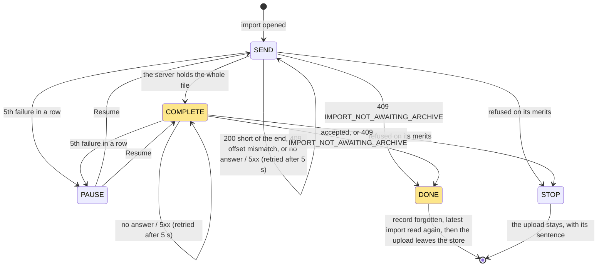

fix: the data travels, the holistic review's findings and the lot's documents

## Context

The closing block of the lot *the data travels* (import and export from the account screen), stacked on #228 at the top of the ten pull requests. At the operator's request the holistic review ran on the top of the stack **before any merge**, so its findings reach you here, above the nine pull requests they concern: 1 MAJOR, 11 MINOR. This block fixes them, then corrects the handoff, the backlog and three contradictions in the specification.

## Why: the upload treated two answers as final when they were not

The import uploads its archive one chunk at a time from a store that lives above the router, then closes it with `POST .../archive/complete`. A **stopped** upload stays in that store, and the store outranks the server's row in the account section and the task centre, with Cancel as its only control. Two answers stopped it wrongly:

- **A close whose answer was lost** on the way back: the server had closed the upload and the import was `PENDING` or `RUNNING`, but the tab showed a stopped upload whose Cancel would `DELETE` the running import.
- **`409 IMPORT_NOT_AWAITING_ARCHIVE`**, which is what the losing tab of the two-tabs case receives: same position, "This import no longer accepts an archive" over an import that is going fine.

## How: the close is one more attempt, and the server's row has the last word

The decisions stay in the pure `lib/imports.ts` (inside the 100 % coverage bound); the store only performs them. The close now retries like a chunk, and a new terminal step, `DONE`, hands over to the server's row.

What the tab shows, before and after:

| Situation | Before | Now |
|---|---|---|
| Close sent, answer lost | Stopped upload, Cancel over a running import | Close sent again; the second gets `IMPORT_NOT_AWAITING_ARCHIVE`, and the pending import shows |
| Another tab closed the upload first | "This import no longer accepts an archive", Cancel | The server's import |
| Close accepted | Upload dropped before the row was read: "stopped before the end" for one round trip | Row read first, then the upload dropped: no flash |
| Cancel refused during an upload | Upload dropped before the `DELETE`, refusal silent | Upload kept until the `DELETE` settles; the refusal shows under the running progress bar |
| A latest-import read begun before the import opened | Could prune the new import's resume record | The tab's own upload's record is never pruned |

`IMPORT_NOT_AWAITING_ARCHIVE` no longer stops anything, so its sentence left both catalogues. Two tabs uploading one archive stays possible: the operator accepted it as a known limit with no guard ("Q1"), and the backlog now points to it from Known limits.

## The rest of the review

- **Kept**: the `ImportsConfig` comment that reached `api/` in web application block #222 (it was moved there to keep block 10 under the file bound); recorded in the handoff.
- **Fixed, no behaviour change**: journey row fixtures typed by the contract's states; redundant empty list routes deleted from seven journeys; a journey case for a refused opening of an import; catalogue formatting; comments citing "decision D1" without the document; KDoc on `maxImportArchiveBytes`.
- **Documents**: the handoff and the specification are corrected in place with `(Corrected: ...)` markers, which keeps what was written while the stack was open. The handoff's merge figures and the operator's reading are left to fill after your review.

Block report, for the handoff

**Evidence**
- Gate: `dagger call gate` green at `6de14f7b`, exit 0. Clients: 55 files, 280 tests; `src/lib` at 100 % of lines and branches.
- Red before the fix: the three new behaviour cases (the success flash, the lost close, the refused cancel) failed against the unfixed store. The refused-opening case passed already: a coverage gap, not a defect.
- Budget against `feat/the-task-centre-keeps-data-notices`: 278 lines, 18 files.
- Continuous integration: run 36160705746, green, `verify` 7 min 49 s.
- Headless reading (Firefox, stubbed API, 1280 and 380 px, the section's text sampled every 25 ms): a success goes from 100 % straight to "The archive is waiting to be imported." with no frame of the reload sentence; with every close cut for a second, the section holds at 100 %, sends the close again 5 s later, then the 409 hands over to the pending import; a refused cancel shows "That could not be done. Try again in a moment." under the running progress bar. No horizontal overflow at 380 px.

**Departures from the plan**
- The holistic review ran on the top of the stack before any merge and before the operator's reading, at the operator's request, departing from Wrap's "after the last code block has merged". It read `origin/feat/the-task-centre-keeps-data-notices` in place of `origin/main`.
- The `ImportsConfig` finding is kept, not fixed.

**Tier-1 fixes (the holistic review, `.reviews/the-data-travels-holistic.md`, not committed)**
- MAJOR: a stopped upload outranked the server's row with Cancel as its only control; a lost close became a stop; the losing tab of two was in the same position. Fixed as above.
- MINOR, fixed: the success flash; the silent refused cancel; the resume record pruned by a read under way; untyped row fixtures; redundant empty list routes; no test for a refused opening; catalogue formatting churn; comments naming a decision or section without the document; the specification contradicting its corrections (Branches header, section 5, section 6); no KDoc on `maxImportArchiveBytes`.
- MINOR, kept: the `ImportsConfig` comment in #222.
- Partly wrong findings: #222's 264 lines do count the `ImportsConfig` comment (2 lines, 1 file); `maxFileBytes` and `maxPixels` carry no KDoc either.

**Tier-2 questions**: none in this block. Recorded here: "Q1" (asked in block 40), the two-tabs resume risk is an accepted known limit with no guard; and the operator's request to run the holistic review before their reading.

**Pitfalls**
- Firefox resends a `POST` cut on a reused connection by itself, up to four times within the same millisecond: a stub that cuts only the first close tests the browser's retry, not the application's.

**Not verified**
- The screens were read against a stubbed API, never the running API.
- The handoff's merge figures (wall-clock time, review latency, cascaded rebases) and the operator's reading exist only after the review and the merges: left to fill.

🤖 Generated with [Claude Code](https://claude.com/claude-code)
