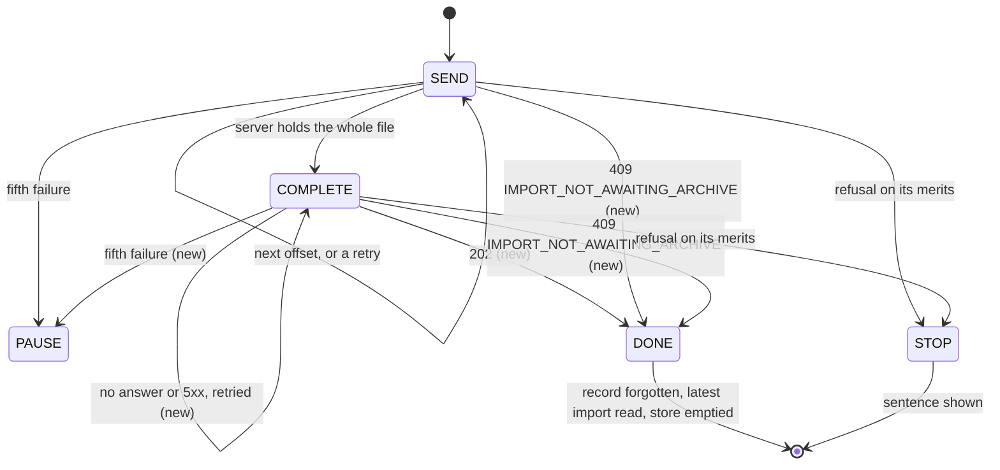

fix(webapp): the data travels closes, the holistic review's findings

The closing block of the lot `the-data-travels`, on #228 at the top of the stack. At the operator's request the holistic review ran on the top of the stack before any merge: 1 MAJOR and 11 MINOR. This pull request fixes them, so the findings reach the reviewer here, above the nine pull requests they describe.

## Why

The upload store (`imports.ts`, above the router) treated two answers as a failure of the upload when they meant the server had already moved on. A stopped upload then **outranked the server's row** in the section and the task centre for the rest of the tab's life, with Cancel as its only control, and that Cancel sends `DELETE` to an import that may already be `PENDING` or `RUNNING`.

| Situation | Before | After |
|---|---|---|
| The close reaches the API, its answer is lost | Upload stopped: "stopped before the end", Cancel only | The close is sent again on the chunks' schedule; the second gets `409 IMPORT_NOT_AWAITING_ARCHIVE` and gives way to the `PENDING` row |
| Another tab closed the upload first (the accepted two-tabs limit) | Stopped on "This import no longer accepts an archive", Cancel over the running import | Same handover: the server's import shows |
| The upload succeeds | "stopped before the end" flashes for one round trip | The store lets go only once the latest import has been read again |
| A cancel is refused from the upload view | Silent: the view holding the mutation had unmounted | The upload stays until the `DELETE` settles, so the refusal shows and the upload goes on |
| A read of the latest import races the opening (window refocus as the file dialog closes) | Could prune the fresh resume record | The tab's own upload's record is never pruned; a finished upload forgets its own |

## How

The close becomes an attempt like a chunk, and the loop gains a terminal step, `DONE`, that hands over to the server's row. The decision stays in the pure `nextStep` of `lib/imports.ts`, inside the coverage bound; the store only performs it.

`IMPORT_NOT_AWAITING_ARCHIVE` no longer reaches the user, so its sentence leaves both catalogues. A pause after a failed close resumes on the close, not on a chunk.

The minor findings are test and text hygiene: the journeys' row fixtures typed by the contract, the empty list routes that #227's defaults made redundant removed from seven journeys, a journey case for a refused opening, catalogue formatting, comments that cited "decision D1" without naming the document, a KDoc on `maxImportArchiveBytes`. The specification's three self-contradictions and the handoff are corrected with `(Corrected: ...)` entries, and the backlog's Known limits points at the two-tabs limit.

Block report, for the handoff

**Evidence**
- Gate: `dagger call gate` green at `6de14f7b`, exit 0; clients 55 files, 280 tests; `src/lib` coverage 100 % of lines and branches.
- Continuous integration: run 36160705746, green, `verify` 7 min 49 s.
- Budget against `feat/the-task-centre-keeps-data-notices`: 278 lines, 18 files.
- Red before the fix: the three new behaviour cases (the flash, the lost close, the refused cancel) failed against the unfixed store. The refused-opening case passed already: a coverage gap, not a defect.
- Headless reading (Firefox, stubbed API, 1280 and 380 px, the section's text sampled every 25 ms): the success goes from 100 % straight to "The archive is waiting to be imported." with no frame of the reload sentence; with every close cut for a second, the section holds at 100 % and sends the close again 5 s later, then the 409 hands over to the pending import; a refused cancel shows "That could not be done. Try again in a moment." under the running progress bar. No horizontal overflow at 380 px.

**Departures from the plan**
- The holistic review ran on the top of the stack before any merge and before the operator's reading, at the operator's request, rather than after the last merge as Wrap says. It read `origin/feat/the-task-centre-keeps-data-notices` in place of `origin/main`.
- The ImportsConfig finding (an API comment arriving in a web application block) is kept, not fixed, and recorded in the handoff: `eef0c88f` took it out of block 10 to stay under the file bound and `ddabed5a` (#222) carried it back.
- Two findings were partly wrong: #222's 264 lines do count the ImportsConfig comment (2 lines, 1 file), and `maxFileBytes` and `maxPixels` carry no KDoc either.

**Tier-1 fixes** (the holistic review's findings, `.reviews/the-data-travels-holistic.md`, not committed)
- MAJOR: a stopped upload outranked the server's row with Cancel only, and a lost close turned into a stop. Fixed: the close is retried on the chunks' schedule; `IMPORT_NOT_AWAITING_ARCHIVE`, to a chunk or to the close, ends the upload and hands over to the row once read. The losing tab of the two-tabs case gets the same handover.
- MINOR, each fixed: the success flash; the silent refused cancel; the read that pruned a fresh record; untyped row fixtures; redundant empty list routes (three journeys named, four more carrying the same); no test for a refused opening; catalogue formatting; comments citing a decision or a section without the document; the specification's three contradictions (Branches header, section 5, section 6); the missing KDoc on `maxImportArchiveBytes`.
- MINOR, kept: the ImportsConfig comment, above.

**Tier-2 questions**: none in this block. The two-tabs text rests on the operator's earlier answer "Q1": the two-tabs resume risk is an accepted known limit with no guard.

**Pitfall**: Firefox resends a `POST` cut on a reused connection by itself, up to four times within the same millisecond. A stub that cuts only the first close tests the browser's retry, not the application's: cut every close for a window instead.

**Not verified / left to fill**: the handoff's merge figures (wall-clock time, review latency, cascaded runs) and the operator's reading, which exist only after the review and the merges. Two tabs on one import still run unguarded, as accepted.

🤖 Generated with [Claude Code](https://claude.com/claude-code)
