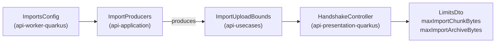

feat(api): the data states are declared and the handshake publishes the import bounds

## Context

The API has served export and import for a while (twelve operations under `/api/v1/me/exports` and `/api/v1/me/imports`), and the web application calls none of them. The lot *the data travels* brings both to the account screen and to the task centre, as a stack of six pull requests. This one is the bottom of the stack: it changes only the contract, so that the five client blocks above it are typed against what they need. It also carries the lot's specification.

## Why

A client building the export and import screens hits two gaps in the contract.

**1. The two `state` fields are plain strings**, yet the client's behaviour hangs on them: whether to poll, which buttons to show, whether a download link exists. An unknown state has no correct default, so the set is closed. The fields that only choose a sentence stay open, because an unknown value has a correct fallback (a general sentence) and closing them would make every new anomaly a contract major:

| Field | Drives | Published as |
|---|---|---|
| export `state`, import `state` | behaviour | `enum` (closed), new in this block |
| issue `kind`, `failureCode` | a sentence | `string` (open), unchanged |

**2. The import's chunk size and archive bound are published nowhere.** Both live in `imports.*` (16 MiB and 20 GiB by default). The client needs the first to cut its chunks and the second to refuse a file before opening an import; a size hard-coded in the bundle would drift from a deployment that lowers the key. They join the image limits already in the handshake's `LimitsDto`.

## How

The states get presentation twins of the domain enums (`UserDataExportStateDto`, `UserDataImportStateDto`), the shape `DownloadStatusDto` already has. Each mapper converts with an exhaustive `when`, so a domain state added later fails the build rather than reaching a client unannounced.

The bounds cannot be read where the handshake lives: `ImportsConfig` belongs to the worker module, which the presentation module may not depend on. They take the path `maxArchiveBytes` already takes to the chunk receiver, through the composition root:

No module gains a dependency. The alternative, a second `@ConfigMapping` on `imports.*` inside the presentation module, would declare every default twice.

**The contract goes from 17.0.0 to 18.0.0.** `oasdiff` reads an enum added to a response as breaking (`response-property-enum-value-added`); the alpha allows a major freely and nothing is frozen yet. The two new `LimitsDto` fields are required, which is why one client test fixture changes.

The tests pin the contract to the domain: the published enums hold exactly the domain's entries, `kind` is still an open string, and the handshake answers a test profile's overridden `imports.*` values rather than the defaults.

The block also files one backlog item: the contract's other string fields (`reasonCode` and `DownloadStatusDto` among them) weighed as open or closed by the same test.

Block report, for the handoff

**Position.** Block 10 of the lot `the-data-travels`, bottom of the stack, base `main`; block 20 is next up. Consumers: the states are first read by block 20 (export section), the two bounds by block 30 (upload).

**Evidence.**
- Gate: `dagger call gate` green at 699d7959, 2 min 48 s, exit 0. The last commit, eef0c88f, only puts a comment back to its text on `main`.
- Continuous integration: run 36143519541, green, verify 7 min 40 s.
- Budget against `main`: 163 lines, 19 files.
- `contract-guard`: green at 18.0.0; red at 17.1.0 with `api-major-version-not-bumped` (set 17.1.0, regenerated, restored).
- Mutations: with the 17.0.0 contract restored, the states test fails (`expected: <[PENDING, READY, FAILED, EXPIRED, DELETED, SUPERSEDED]> but was: <[]>`); with an `enum` added to `kind`, the open-kind test fails.

**Departures from the plan.**
- One client file changed, `clients/apps/webapp/src/lib/uploads.test.ts`: its `LIMITS` fixture is typed by the generated client and the two new `LimitsDto` fields are required, so the clients' typecheck refused it.
- `ImportUploadBounds` is a data class, not the value class the specification names: it holds two fields.
- A tier-1 fix left out for the file bound: the comment on `ImportsConfig.maxChunkBytes` names the wrong test (`ImportsConfigIntegrationTest` instead of `BodyLimitCheck`). Fixing it made 20 files, so it is left to block 30.

**Tier-1 fixes.** The `ImportProducers` KDoc said "The three import beans"; now "The import beans".

**Tier-2 questions.** None.

**Pitfalls.**
- A required field added to a DTO breaks the clients' typed fixtures, not the Gradle build; only the full gate caught it.
- `gh stack submit --auto` titles the pull request after the branch and writes no body.

**Not verified.** The pre-push gate did not show in `gh stack submit`'s output; whether it runs through `gh stack` is not established.

🤖 Generated with [Claude Code](https://claude.com/claude-code)
