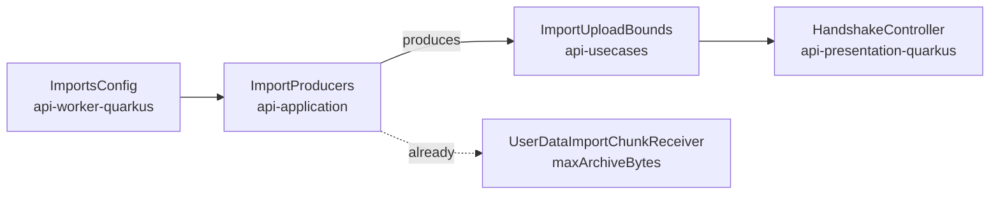

feat(api): the data states are declared and the handshake publishes the import bounds

## Context

The API has served export and import of a user's data for a while: twelve operations under `/api/v1/me/exports` and `/api/v1/me/imports`, none of them called by the web application. The lot *the data travels* brings them to the account screen and the task centre. This first block changes the contract only, so the client blocks above it have something to read. It also carries the lot's specification, `docs/specs/2026-09-25-the-data-travels.md`.

## Why

The client is missing two things:

- **The export's and the import's `state` are plain strings.** The client decides from the state whether to poll, which buttons to show and whether a download link exists. An unknown state has no correct default, so the contract has to promise the full set.
- **The import's chunk size and archive bound are published nowhere.** `imports.max_chunk_bytes` (16 MiB) and `imports.max_archive_bytes` (20 GiB) live in `ImportsConfig`. A size hard-coded in the bundle would drift from a deployment that lowers either key.

## How

**One rule decides open or closed: does the client's behaviour depend on the value, or only a sentence?**

| Field | On the wire | Why |
|---|---|---|
| export `state`, import `state` | `enum`, closed | Drives behaviour. The client maps it through a `Record` keyed by the union, so a state it does not handle fails the typecheck |
| issue `kind`, `failureCode` | `string`, open | Drives a sentence with a general fallback, as `reasonCode` already does. Closed, every new anomaly would be a contract major |

The closed states are presentation twins of the domain enums, the shape `DownloadStatusDto` already has, and the mappers map them with an exhaustive `when`. A test per twin walks every domain entry, so a state added to the domain later fails the build instead of reaching the wire unannounced. `oasdiff` reads a response enum as closed, so declaring one is a break: **the contract goes from 17.0.0 to 18.0.0**. The alpha allows this, and `contract/frozen/` is still empty. The same question for the contract's other string fields is filed in the backlog, not settled here.

**The two bounds join `LimitsDto`**, beside the image limits a client already checks before sending. They cannot be read where the handshake lives: `ImportsConfig` is in the worker module, which the presentation module may not depend on. They take the path `maxArchiveBytes` already takes to the chunk receiver:

No module gains a dependency. The alternative, a second `@ConfigMapping` on `imports.*` in the presentation module, would declare each default twice.

Both new fields are required, which is why one client file changes: a test fixture typed by the generated client. The states are first read by block 20 (the export section), the bounds by block 30 (the upload).

Block report, for the handoff

**Evidence**

- Gate: `dagger call gate` green at `699d7959`, 2 min 48 s, exit 0. The last commit, `eef0c88f`, only restores a comment to its text on `main`.
- Continuous integration: run 36143519541, green, `verify` 7 min 40 s.
- Budget against `main`: 163 lines, 19 files.
- `contract-guard`: green at 18.0.0; red at 17.1.0 with `api-major-version-not-bumped` (checked by setting 17.1.0, regenerating, then restoring).
- Mutations: with the 17.0.0 contract restored, the states test fails (`expected: <[PENDING, READY, FAILED, EXPIRED, DELETED, SUPERSEDED]> but was: <[]>`); with an `enum` added to `kind`, the open-kind test fails.

**Departures from the plan**

- One client file changed, `clients/apps/webapp/src/lib/uploads.test.ts`: its `LIMITS` fixture is typed by the generated client and the two new `LimitsDto` fields are required, so the clients' typecheck refused it.
- `ImportUploadBounds` is a data class, not the value class the specification names: it holds two fields.
- A tier-1 fix left out for the file bound: the comment on `ImportsConfig.maxChunkBytes` names the wrong test (`ImportsConfigIntegrationTest` instead of `BodyLimitCheck`). Fixing it made 20 files, so it is left to block 30.

**Tier-1 fixes**

- The `ImportProducers` KDoc said "The three import beans"; now "The import beans".

**Tier-2 questions**

- None.

**Pitfalls**

- A required field added to a DTO breaks the clients' typed fixtures, not the Gradle build; only the full gate caught it.
- `gh stack submit --auto` titles the pull request after the branch and writes no body.

**Not verified**

- The pre-push gate did not show in `gh stack submit`'s output; whether it runs through `gh stack` is not established.

🤖 Generated with [Claude Code](https://claude.com/claude-code)
