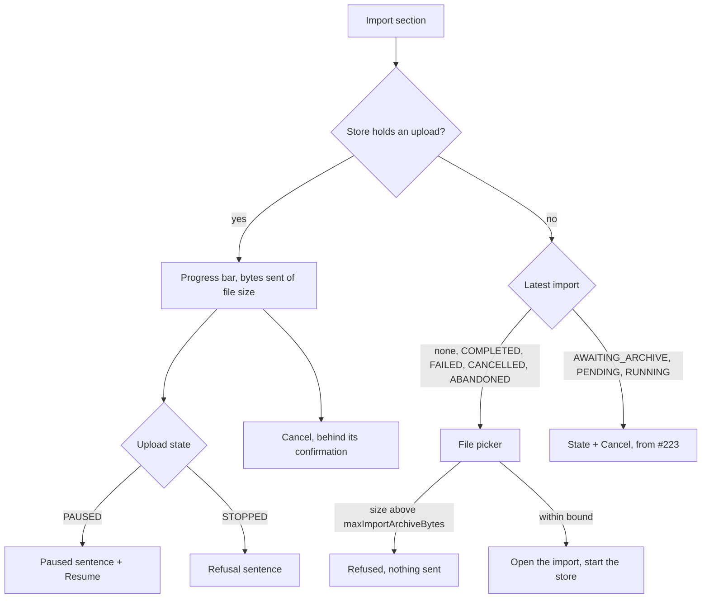

feat(webapp): the archive uploads from the account screen

The lot *the data travels* lets a user import a Pinry archive from `/account`, with an upload that survives a network cut and a change of screen. The upload is chunked: the import is opened by `POST`, fed by `PUT .../archive?offset=` slices as large as the handshake's `maxImportChunkBytes`, then closed by `POST .../complete`. Block 30 (#222) built the upload store and the pure decisions of its loop; block 34 (#223) gave the Import section its read side and the cancel confirmation. Nothing yet let a user pick a file, so neither was reachable. This pull request is the third of the three blocks block 30 was split into: the file picker, the upload's view, and the journeys that drive the whole upload through the real section.

## How it fits

The section now answers two sources, in this order: the upload this tab holds, then the latest import on the server. The store lives above the router, so the upload keeps running while the account screen is unmounted, and coming back finds it where it stands.

- **The picker waits for the handshake**: it stays disabled until the chunk size and the archive bound are known, and a file past the bound is refused before any import is opened on the server.
- **One table maps every reason an upload stops to a sentence**: the server's refusal codes of the three import operations, and the two the loop names itself (a proxy's bodyless `413`, and a server holding more bytes than the file has). A code the bundle does not know gets the general sentence, as the export's refusals already do; the lookup uses `hasOwn`, so `constructor` is not a code.
- **The page holds on close** (`beforeunload`) only while bytes remain; a stopped or finished upload releases it.

## What the journeys pin

With a handshake publishing a 4-byte chunk and a 10-byte archive:

| Case | Observable |
|---|---|
| Plain upload | `PUT`s at 0, 4, 8 with `application/octet-stream` and the right slices, one `complete` |
| A lost request, then a chunk cut at 6 (`409`, `currentLength` 6) | Offsets 0, 0, 4, 6: the server's file length is the truth |
| Server holds 12 bytes | Stops with its sentence, no `complete`, page no longer held |
| Five lost requests | Pauses behind Resume, which sends the sixth `PUT` and finishes |
| File above the bound | Refused, no request at all |
| Leave for `/` mid-upload | The chunk at 8 leaves with the section unmounted; back on `/account` the bar reads 8 |

Block report, for the handoff

**Position.** Block 37 of the lot `the-data-travels`, the last of the three blocks block 30 was split into (30, 34, 37) after block 30 measured 892 lines; the operator answered "b" on 2026-09-25. Stacked on #223 (block 34, `feat/the-import-is-followed`), itself on #222 (block 30). Next up: block 40, resuming after a reload.

**Evidence.**
- Gate: `dagger call gate` green at `08412ddd`, exit 0.
- Continuous integration: run 36149285625, green, `verify` 6 min 41 s.
- Budget against `feat/the-import-is-followed`: 367 lines, 7 files.
- Headless reading: Firefox over WebDriver BiDi, the bundle served against a stubbed API that cuts sockets or answers 507 on demand, at 1280 and 380 px: uploading at 52 %, the cancel confirmation during an upload, paused after the five attempts (23 s real), stopped by a 507, a 60 MB file against a 50 MB bound. No horizontal overflow; nothing needed fixing.

**Departures from the plan.** This block is the rest of block 30's row after 34's cancel case. The three blocks together differ from the single 892-line block only by #223's two display fixes and this journey's `openTheAccount` helper taking its answer as an option.

**Tier-1 fixes.** None.

**Tier-2 questions.** The split above, carried by #222.

**Pitfalls.**
- jsdom's `Blob` does not survive Node's `fetch`: a slice of a jsdom `File` reaches MSW as the text "undefined", so the journey builds its archive with `node:buffer`'s `File`. The browser is unaffected.
- The retry wait is real time, so the journeys use fake timers with `shouldAdvanceTime` and advance by `RETRY_MS`.
- A stopped upload leaves the import `AWAITING_ARCHIVE` on the server; the section then offers cancel and no picker. Block 40 adds resuming with the same file.

**Not verified.** Whether one `PUT` at a time with a 5-second wait suffices against a half-open connection (specification section 9).

🤖 Generated with [Claude Code](https://claude.com/claude-code)
