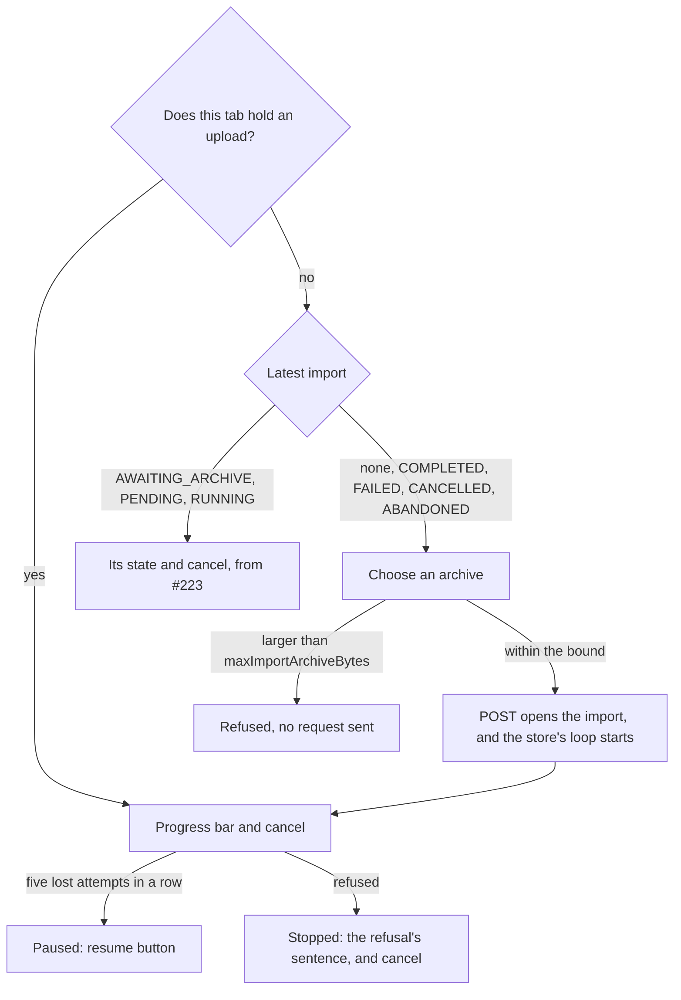

feat(webapp): the archive uploads from the account screen

The lot *the data travels* lets a signed-in user export their data and import an archive from `/account`. An import follows a protocol with three steps: `POST` opens it, `PUT ...archive?offset=` chunks feed it, and `POST ...archive/complete` closes it. The handshake publishes the chunk size and the archive's upper bound (block 10). This pull request is the last of the three that block 30 was split into. #222 built the upload store, which lives in a module above the router, and the pure decisions of its loop. #223 built the section's read side and the cancel confirmation.

**Why:** the store has no consumer yet, so a user still cannot start an import. This block connects it to the screen through a file picker and an upload view. It also gives every way an upload can stop a sentence the user reads.

**How:** the section reads from two sources. The upload held by this tab takes precedence over the server's latest import. While chunks are going up, that row is `AWAITING_ARCHIVE`, and on its own it would show only the cancel button.

- **The picker checks the size bound before it opens an import**, so an archive that could never fit leaves no row on the server. The picker stays disabled until the handshake has answered, because until then the client knows neither the chunk size nor the bound.
- **The upload outlives the screen**, because the store lives above the router. Leaving `/account` keeps it running, and coming back finds it further along. `beforeunload` holds the page only while bytes remain to send.
- **Refusals are an open set, mapped to sentences with a fallback**, as the export's already are. Their type is the union of the refusal codes the contract declares for the three operations, plus two codes the loop raises itself: `CHUNK_TOO_LARGE`, for a proxy's `413` with no body, and `ARCHIVE_LONGER_THAN_FILE`, for when the server holds more bytes than the file has. `satisfies` makes a misspelt code fail the typecheck, and a code this bundle does not know gets the general sentence. The export's lookup is generalised to both tables.
- **The picker is a native `<input type="file">`**, with its label styled as a HeroUI button. HeroUI has no file control.

The import journey runs against a handshake with a 4-byte chunk and a 10-byte archive:

| Case | What the server does | What the journey sees |
|---|---|---|
| The normal path | Appends every chunk | `PUT`s at 0, 4 and 8 as `application/octet-stream`, then one `complete` |
| A lost request, then a cut chunk | A network error, then `409` with `currentLength` 6 on the chunk at 4 | Offsets 0, 0, 4, 6, and the last body is `6789` |
| A different file | `409` with `currentLength` 12 | The upload stops with its sentence, sends no `complete`, and no longer holds the page |
| Five lost requests | Five network errors | The upload pauses, and resume sends the chunks at 0, 4 and 8 |
| The file is too large | Nothing: the bound is 9 bytes | The upload is refused and no request is sent |
| Leaving mid-upload | Holds each chunk | The chunk at 8 leaves while `/account` is not mounted. On return the progress reads 8, and the page is released at the end |

The journeys cover resuming after a network cut. Resuming after the page reloads is block 40's job.

Block report, for the handoff

- **Position:** block 37 of the lot `the-data-travels`, the last of the three blocks that block 30 was split into (30, 34 and 37). Block 30 had measured 892 lines, and the operator answered "b" on 2026-09-25. This is stacked on #223 (block 34, `feat/the-import-is-followed`), which is stacked on #222 (block 30). The next block up is 40, resuming after a reload.
- **Gate:** `dagger call gate` was green at `08412ddd`, exit 0.
- **Continuous integration:** run 36149285625 was green, with `verify` taking 6 min 41 s.
- **Budget:** 367 lines over 7 files, against `feat/the-import-is-followed`.
- **Headless reading:** Firefox over WebDriver BiDi, with the bundle served against a stubbed API that cuts sockets or answers `507` on demand, at 1280 and 380 px. Screens read: uploading at 52 %, the cancel confirmation during an upload, paused after the five attempts (23 s of real time), stopped by a `507`, and a 60 MB file against a 50 MB bound. No horizontal overflow appeared, and nothing needed fixing.
- **Departure from the plan:** this block is the rest of block 30's row, after 34's cancel case. The three blocks together differ from the single 892-line block in two ways only: #223's two display fixes, and this journey's `openTheAccount` helper, which now takes its answer as an option.
- **Tier-1 fixes:** none.
- **Tier-2 questions:** the split above, carried by #222.
- **Pitfall:** jsdom's `Blob` does not survive Node's `fetch`. A slice of a jsdom `File` reaches MSW as the text `"undefined"`, so the journey builds its archive with `node:buffer`'s `File`. The browser is not affected.
- **Pitfall:** the wait before a retry is real time, so the journeys use fake timers with `shouldAdvanceTime` and advance by `RETRY_MS`.
- **Pitfall:** a stopped upload leaves the import `AWAITING_ARCHIVE` on the server, and the section then offers cancel and no picker. Block 40 adds resuming with the same file.
- **Not verified:** whether one `PUT` at a time, with a 5-second wait before a retry, is enough against a half-open connection (specification, section 9).

🤖 Generated with [Claude Code](https://claude.com/claude-code)
