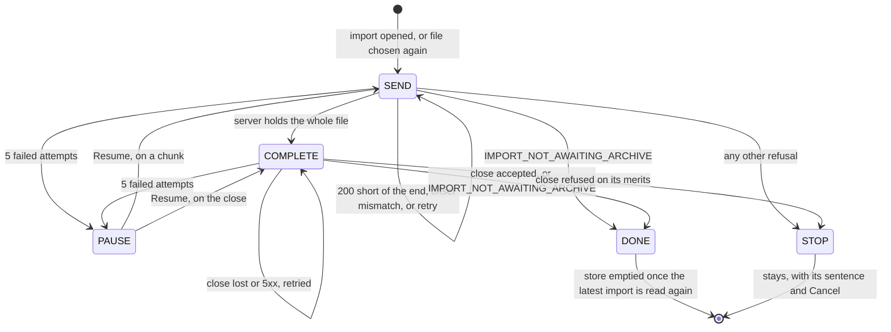

fix(webapp): the data travels closes, the upload gives way to the server's import

The closing block of the lot *the data travels*, on top of the stack (#228). The holistic review ran on the whole stack before any merge, at the operator's request, and found 1 MAJOR and 11 MINOR. This pull request fixes them and corrects the lot's handoff, backlog and specification. Reading it first saves reviewing, in the nine below, an upload behaviour that no longer holds.

## Why

The web application's upload lives in a module store above the router. While the store holds an upload, that upload outranks the server's import row, both in the account's import section and in the task centre. Before this block, the upload stopped on two answers where the server had in fact moved on:

- **the close's answer was lost**: the `POST .../archive/complete` did arrive, so the import was already `PENDING` or `RUNNING`, but the loop stopped on the network error;
- **`IMPORT_NOT_AWAITING_ARCHIVE`**: the answer the losing tab gets when two tabs upload one import.

Either way the tab kept a stopped upload hiding a live import, with Cancel as its only control, and that Cancel would `DELETE` the running import. That was the MAJOR finding.

## How

`IMPORT_NOT_AWAITING_ARCHIVE` no longer means "refused". It now means "the server has moved on": the upload ends and the server's row takes over. The close joins the same retry schedule as the chunks (the pure `nextStep` in `lib/imports.ts` now decides both), so a lost close is simply sent again. If it did arrive the first time, the second one gets that 409 and hands over.

The same rule, that the store gives way only once the server's row is back, closes three of the MINOR findings:

| Situation | Before | After |
|---|---|---|
| Successful upload | For one round trip, the stale `AWAITING_ARCHIVE` row showed "The upload of pinry.zip stopped before the end" | The store empties only after the latest import is read again |
| Cancel refused mid-upload | Nothing shown: the store was emptied before the `DELETE`, which unmounted the component holding the mutation | The store stays until the `DELETE` settles, so the refusal shows under the running upload |
| A read of the latest import started before this tab's import opened | Could delete the new import's resume record | This tab's own upload's record is never pruned, and a finished upload forgets it itself |

The other findings are local: typed row fixtures, redundant list routes deleted from journeys, a test for a refused opening, catalogue formatting, comments that cited "decision D1" without naming the document, and a KDoc on `maxImportArchiveBytes`. The `ImportsConfig` finding stays as it is, with its reason recorded in the handoff. With `IMPORT_NOT_AWAITING_ARCHIVE` no longer a refusal, its sentence leaves both catalogues.

Documents: the handoff is corrected in place with `(Corrected: ...)` notes, and gains a table of the review's findings and exits. The backlog points to the two-tabs limit, which the operator accepted with no guard ("Q1"). The specification's three contradictions are fixed.

Block report, for the handoff

**Position.** Closing block of `the-data-travels`, `fix/the-data-travels-closes`, on #228 (block 65), at the top of a stack of ten pull requests, none merged. Findings: `.reviews/the-data-travels-holistic.md` (not committed), 1 MAJOR and 11 MINOR.

**Evidence.**
- `dagger call gate` green at `6de14f7b`, exit 0. Clients: 55 files, 280 tests. `src/lib` coverage: 100 % of lines and branches.
- Continuous integration: run 36160705746, green, `verify` 7 min 49 s.
- Budget against `feat/the-task-centre-keeps-data-notices`: 278 lines, 18 files.
- Red before the fix: the three new behaviour cases (the flash, the lost close, the refused cancel) failed against the unfixed store. The refused-opening case passed already: a coverage gap, not a defect.
- Headless reading (Firefox, stubbed API, 1280 and 380 px, the section's text sampled every 25 ms):
  - a success goes from 100 % straight to "The archive is waiting to be imported.", with no frame of the reload sentence;
  - with every close cut for a second, the section holds at 100 %, sends the close again 5 s later, and the 409 then hands over to the pending import;
  - a refused cancel shows "That could not be done. Try again in a moment." under the running progress bar;
  - no horizontal overflow at 380 px.

**Tier-1 fixes (the review's findings and their exits).**
- MAJOR, a stopped upload outranked the server's row, with Cancel as its only control, and a lost close stopped the upload. Fixed: the close is retried on the chunks' schedule, and `IMPORT_NOT_AWAITING_ARCHIVE`, to a chunk or to the close, gives way to the row once it is read. Journey case: a close whose answer is lost.
- Success flash of the reload sentence. Fixed: the upload leaves the store only after the latest import is read again. The first upload journey asserts the sentence never shows.
- Silent refused cancel. Fixed: the upload stays until the `DELETE` settles and the row is read. Journey case: a cancel refused during an upload.
- A read begun before an import opened could delete its fresh record. Fixed: this tab's own upload's record is never pruned, and a finished upload forgets its record itself.
- Row fixtures took any string as a state. Fixed: typed by the contract.
- Redundant empty export and import list routes. Fixed: deleted from the three journeys named and from four data journeys that carried the same.
- No test for a refused opening. Fixed: an import already running refuses the opening, and nothing is sent.
- Catalogue formatting churn. Fixed.
- Comments naming a decision or section without the document. Fixed: the references are dropped, since each sentence already says why.
- Specification contradicting its corrections. Fixed: three `(Corrected: ...)` entries, in the Branches header, section 5 and section 6.
- `maxImportArchiveBytes` had no KDoc. Fixed.
- `ImportsConfig`'s comment in a web application block: kept, as the review suggests. `eef0c88f` took it out of block 10 to stay under the file bound, and `ddabed5a` (block 30, #222) carried it back.

**Departures from the plan.**
- Two findings were partly wrong. #222's 264 lines and 4 files do count the `ImportsConfig` comment (2 lines, 1 file). `maxFileBytes` and `maxPixels` carry no KDoc either.
- The specification still describes the old behaviour in two places. Decision F4, step 5 lists `IMPORT_NOT_AWAITING_ARCHIVE` among the refusals that stop the upload. D1's pruning rule still deletes every record other than the latest `AWAITING_ARCHIVE` import's. The handoff records the new behaviour; the specification got only the three corrections above.
- Wrap ran before the merges: the holistic review read `origin/feat/the-task-centre-keeps-data-notices` in place of `origin/main`.

**Tier-2 questions.** None in this block. Operator decisions it records:
- "Q1": the two-tabs resume risk is a known limit with no guard.
- "Lance la revue holistique avant que je relise": the holistic review runs on the top of the stack, before any merge.

**Pitfalls.** Firefox resends a POST cut on a reused connection by itself, up to four times within the same millisecond. A stub that cuts only the first close tests the browser's retry, not the application's.

**Not verified or still to fill.**
- The handoff's merge figures, wall-clock time and review latency, and the operator's own reading: to fill after the operator's review, before this block merges.
- The screens were read headless against a stubbed API, never against the running API.

🤖 Generated with [Claude Code](https://claude.com/claude-code)
