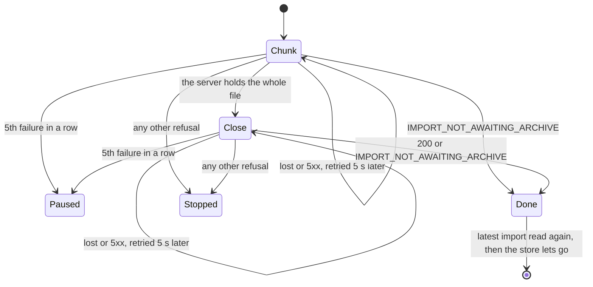

fix(webapp): the data travels closes on the holistic review's findings

## Context

This is the closing block of the lot *the data travels* (import and export from the account screen), stacked on #228 at the top of the ten pull requests. The operator asked for the holistic review to run on the top of the stack before any merge and before their own reading. It found 1 MAJOR and 11 MINOR. This pull request fixes them and brings the handoff, the backlog and the specification in line with what the stack did.

## Why

The upload lives in a module-level store above the router, which the account section and the task centre both read. While the store holds an upload, it outranks the server's latest import row. Three of the defects came from the moment the upload leaves that store:

- **A stopped upload never gave way (the MAJOR).** If the answer to the close request (`POST .../archive/complete`) was lost, the upload stopped. But the import could already be `PENDING` or `RUNNING` on the server. The stopped upload then outranked the row for as long as the tab stayed open, with Cancel as its only control, and one click sent a `DELETE` to a running import. When two tabs upload one import, the tab that loses the race ended up in the same state.
- **A success flashed a failure.** The upload left the store before the row was read again, so for one round trip the section showed "The upload of pinry.zip stopped before the end."
- **A refused cancel said nothing.** The upload was dropped before the `DELETE` went out, which unmounted the view that would have shown the refusal.

A fourth defect was a race on the resume record. If a read of the latest import was already under way when a new import opened (the window regains focus as the file dialog closes), that read deleted the new import's record.

## How

The fix is two rules, both in the store:

1. **The close is retried the way a chunk is.** The pure decision function in `lib/imports.ts` now takes the current attempt, a chunk at an offset or the close. A lost close is retried on the chunks' schedule. `IMPORT_NOT_AWAITING_ARCHIVE`, whether it answers a chunk or the close, no longer stops the upload: it means the server has moved on, so the loop ends the way a success does.
2. **The upload leaves the store only after the latest import has been read again.** This holds after a success and after an accepted cancel. A refused cancel leaves the upload in place, so the refusal shows under the running progress bar. A read never prunes the record of the tab's own upload; a finished upload deletes its record itself.

`IMPORT_NOT_AWAITING_ARCHIVE` no longer stops anything, so its sentence is removed from both catalogues. Two tabs uploading one import stay unguarded: the operator accepted this as a known limit ("Q1"), and the backlog's Known limits now points to it.

The other findings are mechanical fixes:

- The journeys' row fixtures are now typed by the contract.
- The redundant empty list routes are deleted.
- A journey case now covers a refused opening.
- The message catalogues are reformatted consistently.
- Comments no longer cite "decision D1" without naming the document.
- `maxImportArchiveBytes` has a KDoc.

One finding is kept: the `ImportsConfig` comment that reached `api/` in block 30.

Block report, for the handoff

**Evidence**
- `dagger call gate` green at `6de14f7b`, exit 0. Clients: 55 files, 280 tests. `src/lib` coverage is 100 % of lines and branches.
- Continuous integration: run 36160705746 is green, with `verify` at 7 min 49 s.
- Budget against `feat/the-task-centre-keeps-data-notices`: 278 lines over 18 files.
- Tests red before the fix: the three new behaviour cases (the flash, the lost close, the refused cancel) failed against the unfixed store. The refused-opening case already passed, so it was a coverage gap and not a defect.
- Headless reading in Firefox against a stubbed API, at 1280 and 380 px, with the section's text sampled every 25 ms:
  - A success goes from 100 % straight to "The archive is waiting to be imported.", with no frame of the reload sentence.
  - With every close cut for a second, the section holds at 100 % and sends the close again 5 s later. The 409 then hands over to the pending import.
  - A refused cancel shows "That could not be done. Try again in a moment." under the running progress bar.
  - No horizontal overflow at 380 px.

**Departures from the plan**
- The holistic review ran on the top of the stack, before any merge and before the operator's reading, at the operator's request ("Lance la revue holistique avant que je relise"). It read `origin/feat/the-task-centre-keeps-data-notices` in place of `origin/main`.
- The handoff's merge figures (wall-clock time, review latency, re-triggered runs) and the operator's own reading are left to fill after the operator's review, before this pull request merges.

**Tier-1 fixes (the holistic review, `.reviews/the-data-travels-holistic.md`, not committed)**

| Severity | Finding | Exit |
|---|---|---|
| MAJOR | A stopped upload outranked the server's row, with Cancel as its only control. A lost close turned into a stop while the import could be `PENDING` or `RUNNING`. The losing tab of the two-tabs case was in the same position. | Fixed: the close is retried, and `IMPORT_NOT_AWAITING_ARCHIVE` hands over to the row. Journey case: a lost close. |
| MINOR | A success briefly showed the "stopped before the end" sentence. | Fixed: the store lets go only after the re-read. Journey asserts the sentence never shows. |
| MINOR | A refused cancel from the upload view was silent. | Fixed. Journey case: a refused cancel during an upload. |
| MINOR | A read already under way could delete the fresh import's resume record. | Fixed: the tab's own record is never pruned. |
| MINOR | The `ImportsConfig` comment arrived in a web application block. | Kept, recorded in the handoff. Partly wrong: #222's 264 lines do count it. |
| MINOR | Row fixtures accepted any string as a state. | Fixed: typed by the contract. |
| MINOR | Redundant empty list routes in three journeys. | Fixed: in those three and in four other data journeys. |
| MINOR | No test for a refused opening. | Fixed: journey case. |
| MINOR | Formatting churn in the catalogues. | Fixed. |
| MINOR | Comments cited a decision or a section without the document. | Fixed: references dropped. |
| MINOR | The specification contradicted its own corrections. | Fixed: three `(Corrected: ...)` entries (header, section 5, section 6). |
| MINOR | `maxImportArchiveBytes` had no KDoc. | Fixed. Partly wrong: `maxFileBytes` and `maxPixels` carry none either. |

**Tier-2 questions**: none in this block. The operator decisions it records: "Q1", accepting the two-tabs resume risk as a known limit with no guard; and the holistic review run before the reading.

**Pitfall**: Firefox resends a POST cut on a reused connection by itself, up to four times within the same millisecond. A stub that cuts only the first close tests the browser's retry, not the application's.

**Not verified**: the screens were read against a stubbed API only, never against the running API.

🤖 Generated with [Claude Code](https://claude.com/claude-code)
