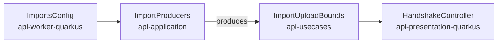

feat(api): the data states are declared and the handshake publishes the import bounds

The API has served export and import for a while, and no client calls them yet. This lot brings both to the web application's account screen; this pull request is the API side the screens need, and it carries the lot's specification (`docs/specs/2026-09-25-the-data-travels.md`).

Two things a client cannot do today:

- **Know which states an export or an import can be in.** `state` is published as a plain string. Yet the client decides on it whether to poll, which buttons to show and whether a download link exists, and an unknown state has no correct default.
- **Know how to cut an upload.** The chunk size (16 MiB) and the archive bound (20 GiB) live in `imports.*` and are published nowhere. A size hard-coded in the bundle would drift from a deployment that lowers them.

## Closed where behaviour depends on it, open where only a sentence does

| Field | What the client does with it | On the wire |
|---|---|---|
| export `state`, import `state` | polls, picks buttons, shows a link | `enum`, from now on |
| issue `kind`, `failureCode` | picks a sentence, with a general one as fallback | `string`, unchanged |

Closing `kind` would make every new kind of anomaly a contract major, and after beta every served major is a frozen document. The states get presentation twins of the domain enums, the shape `DownloadStatusDto` already has, mapped by an exhaustive `when`: a state added to the domain fails the build until its twin follows. A contract test pins both published enums to the domain's values and `kind` to an open string.

For `oasdiff`, declaring an enum on a response is a break, so the contract goes from `17.0.0` to `18.0.0`, which the alpha allows. The contract's other string fields (`reasonCode`, `DownloadStatusDto`) are filed in the backlog, to be weighed by the same rule.

## The import bounds in the handshake

`LimitsDto` gains `maxImportChunkBytes` and `maxImportArchiveBytes`: the client cuts its chunks at the first and refuses a file past the second before opening an import. `ImportsConfig` lives in the worker module, which the presentation module may not depend on, so the bounds take the path `maxArchiveBytes` already takes to the chunk receiver:

No module gains a dependency. A second `@ConfigMapping` on `imports.*` in the presentation module was the alternative, and it would have declared each default twice. The integration test overrides both keys in its profile, so a constant in the controller would fail it.

Both new fields are required, which is why one web application fixture typed by the generated client (`uploads.test.ts`) changes here.

Block report, for the handoff

**Position.** Block 10 of the lot `the-data-travels`, the bottom of the stack, base `main`; block 20 is next up. Carries the lot's specification and files its backlog item. The states are first read by block 20 (export section), the two bounds by block 30 (upload).

**Evidence.**
- Gate: `dagger call gate` green at `699d7959`, 2 min 48 s, exit 0. The last commit, `eef0c88f`, only puts a comment back to its text on `main`.
- Continuous integration: run 36143519541, green, `verify` 7 min 40 s.
- Budget against `main`: 163 lines, 19 files.
- `contract-guard`: green at `18.0.0`; red at `17.1.0` with `api-major-version-not-bumped` (set to 17.1.0, regenerated, restored).
- Mutations: with the 17.0.0 contract restored, the states test fails (`expected: <[PENDING, READY, FAILED, EXPIRED, DELETED, SUPERSEDED]> but was: <[]>`); with an `enum` added to `kind`, the open-kind test fails.

**Departures from the plan.**
- One client file changed, `clients/apps/webapp/src/lib/uploads.test.ts`: its `LIMITS` fixture is typed by the generated client and the two new `LimitsDto` fields are required, so the clients' typecheck refused it.
- `ImportUploadBounds` is a data class, not the value class the specification names: it holds two fields.
- A tier-1 fix left out for the file bound: the comment on `ImportsConfig.maxChunkBytes` names the wrong test (`ImportsConfigIntegrationTest` instead of `BodyLimitCheck`); fixing it made 20 files, so it is left to block 30.

**Tier-1 fixes.** The `ImportProducers` KDoc said "The three import beans"; now "The import beans".

**Tier-2 questions.** None.

**Pitfalls.**
- A required field added to a DTO breaks the clients' typed fixtures, not the Gradle build; only the full gate caught it.
- `gh stack submit --auto` titles the pull request after the branch and writes no body.

**Not verified.** The pre-push gate did not show in `gh stack submit`'s output; whether it runs through `gh stack` is not established.

🤖 Generated with [Claude Code](https://claude.com/claude-code)
