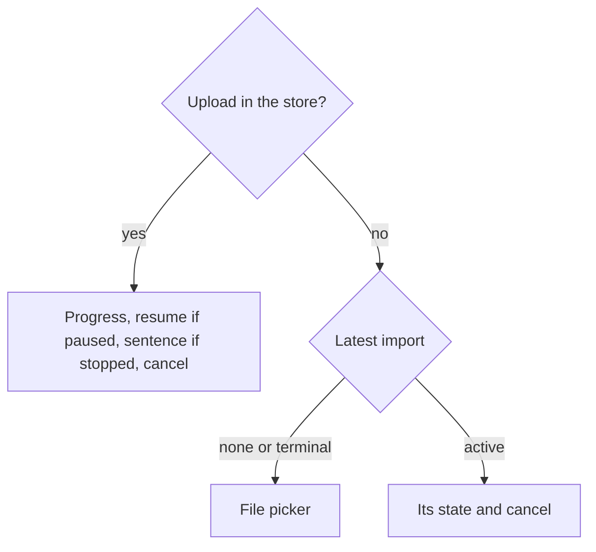

feat(webapp): an archive is chosen and uploaded from the account screen

## Context

The import section on `/account` shows the latest import and can cancel it. Below it, the upload already exists as a module-level store in `imports.ts`, which carries out the pure decisions of `lib/imports.ts`: chunking, reconciling on `409 IMPORT_CHUNK_OFFSET_MISMATCH`, retrying, pausing. Nothing calls it yet: there is no file picker, no progress and no sentence when an upload stops. This pull request adds that consumer, and with it a user can import an archive from start to finish.

## How

The section now reads two sources, the upload this tab holds and the latest import on the server, and the upload wins. It lives above the router, so leaving the screen and coming back finds it where it is. The server's row would show where the upload stood after its last completed chunk.

- **The handshake's two bounds drive the picker.** A file past `maxImportArchiveBytes` is refused before an import is opened, so nothing is sent. An accepted one is cut at `maxImportChunkBytes`. The picker stays disabled until the handshake answers.
- **The store owns pause and stop, and the view only renders them.** After five lost requests in a row the upload pauses behind a resume button. A refusal stops it and shows its sentence.
- **Refusal codes map to sentences through an open table with a fallback**, the same way the export's do. `importRefusal` covers the codes of the three import endpoints, plus two codes the loop raises itself: `CHUNK_TOO_LARGE`, when a reverse proxy answers with a `413` that has no body, and `ARCHIVE_LONGER_THAN_FILE`, when the server holds more bytes than the file has. A code this bundle does not know gets the general sentence. `hasSentence` is now generic over the table, so both mappings share it.
- **An import left in `AWAITING_ARCHIVE` with no upload in this tab offers cancel only.** This happens after a stopped upload or a reload. Resuming with the same file comes in the next block.

The import journey pins the upload against a test handshake that publishes 4-byte chunks, with a 10-byte archive:

| Case | What the journey expects |
|---|---|
| Nothing goes wrong | `PUT`s at 0, 4 and 8 as `application/octet-stream`, each with its slice, then one `complete` |
| One lost request, then a `409` with `currentLength` 6 on the chunk at 4 | Offsets 0, 0, 4, 6: the upload resumes where the server's file stands, not at 8 |
| The server answers `currentLength` 12 | Stops with its sentence, sends no `complete`, the page no longer holds on unload |
| Five lost requests in a row | Pauses, and resume sends the next `PUT` |
| A file past the bound | Refused, and no request at all |
| Navigating to `/` mid-upload | The chunk at 8 leaves while the section is unmounted. Coming back, the progress bar reads 8. `beforeunload` holds the page until the upload ends |

Block report, for the handoff

**Position.** Block 37 of the lot `the-data-travels`, the last of three blocks that block 30 was split into (30, 34, 37) after block 30 measured 892 lines over 17 files. The operator answered "b" on 2026-09-25. Branch `feat/the-archive-uploads`, stacked on #223 (block 34, `feat/the-import-is-followed`), which is stacked on #222 (block 30: the upload store and its pure decisions). The next block up is 40, which resumes an upload after a reload.

**Evidence.**
- Gate: `dagger call gate` green at `08412ddd`, exit 0.
- Continuous integration: run 36149285625, green, with `verify` taking 6 min 41 s.
- Budget against `feat/the-import-is-followed`: 367 lines, 7 files.
- Headless reading: Firefox over WebDriver BiDi, with the bundle served against a stubbed API that cuts sockets or answers `507` on demand, at 1280 and 380 px. States read: uploading at 52 %, the cancel confirmation during an upload, paused after the five attempts (23 s real time), stopped by a `507`, and a 60 MB file against a 50 MB bound. No horizontal overflow, and nothing needed fixing.

**Departures from the plan.** This block holds the rest of block 30's row in the specification's table, after block 34 took the cancel case. Taken together, the three blocks differ from the single 892-line block in two ways only: #223's two display fixes, and this journey's `openTheAccount` helper taking its answer as an option.

**Tier-1 fixes.** None.

**Tier-2 questions.** The three-way split above, answered "b" and carried by #222.

**Pitfalls.**
- jsdom's `Blob` does not survive Node's `fetch`: a slice of a jsdom `File` reaches MSW as the text "undefined". The journey therefore builds its archive with `node:buffer`'s `File`. The browser is unaffected.
- The retry wait is real time. The journeys use fake timers with `shouldAdvanceTime` and advance by `RETRY_MS`.
- A stopped upload leaves the import in `AWAITING_ARCHIVE` on the server, and the section then offers cancel and no picker. Block 40 adds resuming with the same file.
- The upload store is module state and outlives a journey, so `afterEach` calls `dropUpload()`.

**Not verified.** Whether one `PUT` at a time with a 5-second wait between retries is enough against a half-open connection has not been measured (specification, section 9). The server appends without a lock, so a retry sent while the server is still reading the cut request could land two appends on one file.

🤖 Generated with [Claude Code](https://claude.com/claude-code)
