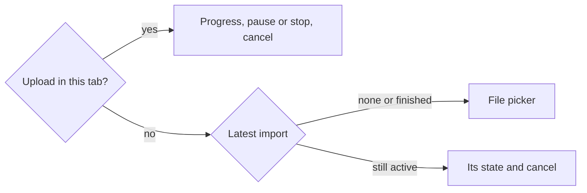

feat(webapp): the archive uploads from the account screen

## Context

The lot *the data travels* lets a signed-in user import a Pinry archive from `/account`. The API takes it in chunks: `POST` opens the import, `PUT .../archive?offset=` appends each chunk, and `POST .../archive/complete` hands it to the worker. The handshake publishes the chunk size and the archive bound. The two blocks below this one built the upload store, which is module state above the router, with the pure decisions of its retry loop, and then the Import section's read side with its cancel confirmation. Nothing lets a user choose a file yet, so the store has no caller.

## Why

This block makes the import usable. It is the last third of block 30, which measured 892 lines and was split in three.

## How

The section now reads this tab's upload before the server's latest import:

- **The picker checks the file against `maxImportArchiveBytes` before any request**, so no import is opened for a file the server would refuse. It stays disabled until the handshake answers, then opens the import and hands the file to the store, cut at `maxImportChunkBytes`.
- **The upload outlives the screen**, the store living above the router: leaving `/account` does not stop it, coming back shows it where it stands, and `beforeunload` holds the tab while bytes remain.
- **Every stop has a sentence**: the refusal codes of the three upload operations, and the two the loop names itself, `CHUNK_TOO_LARGE` (a proxy's bodyless `413`) and `ARCHIVE_LONGER_THAN_FILE` (the server holds more than the file). An unknown code gets the general sentence, as the export's refusals do.

What the journey pins, with a 10-byte archive and a 4-byte chunk:

| The server | `PUT` offsets | Outcome |
|---|---|---|
| appends every chunk | 0, 4, 8 | completed, `PENDING` |
| loses the first request, then answers `409` with `currentLength` 6 at offset 4 | 0, 0, 4, 6 | completed |
| answers `409` with `currentLength` 12 | 0, 4 | stopped with its sentence, no `complete`, tab not held |
| loses five requests in a row | 0 five times, then 0, 4, 8 after Resume | paused, then completed |
| bounds the archive at 9 bytes | none | refused, nothing sent |
| is slow while the user goes to `/` and back | the chunk at 8 leaves with the section unmounted | progress at 8 on return, then completed |

Block report, for the handoff

**Position**: block 37 of the lot `the-data-travels`, the last of the three blocks block 30 was split into (30, 34, 37). Stacked on #223 (block 34, `feat/the-import-is-followed`), itself on #222 (block 30). Next block up: 40, resuming after a reload.

**Evidence**
- Gate: `dagger call gate` green at `08412ddd`, exit 0.
- Continuous integration: run 36149285625, green, `verify` 6 min 41 s.
- Budget against `feat/the-import-is-followed`: 367 lines, 7 files.
- Headless reading: Firefox over WebDriver BiDi, the bundle served against a stubbed API that cuts sockets or answers `507` on demand, at 1280 and 380 px: uploading at 52 %, the cancel confirmation during an upload, paused after the five attempts (23 s real), stopped by a `507`, a 60 MB file against a 50 MB bound. No horizontal overflow; nothing needed fixing.

**Departures from the plan**
- Block 30 measured 892 lines over 17 files; the operator answered "b" on 2026-09-25: three blocks, 30 the store and `lib/imports.ts`, 34 the section's read side and the cancel case, 37 the file picker, the upload view and the journey's upload cases. This block is the rest of block 30's row after 34's cancel case.
- The three blocks together differ from the single 892-line block only by #223's two display fixes and this journey's `openTheAccount` taking its `answer` as an option.

**Tier-1 fixes**: none.

**Tier-2 questions**: the split above, carried by #222.

**Pitfalls**
- jsdom's `Blob` does not survive Node's `fetch`: a slice of a jsdom `File` reaches MSW as the text "undefined", so the journey builds its archive with `node:buffer`'s `File`. The browser is unaffected.
- The retry wait is real time, so the journeys use fake timers with `shouldAdvanceTime` and advance by `RETRY_MS`.
- A stopped upload leaves the import `AWAITING_ARCHIVE` on the server; the section then offers cancel and no picker. Block 40 adds resuming with the same file.

**Not verified**: whether one `PUT` at a time with a 5-second wait suffices against a half-open connection (specification, section 9).

🤖 Generated with [Claude Code](https://claude.com/claude-code)
