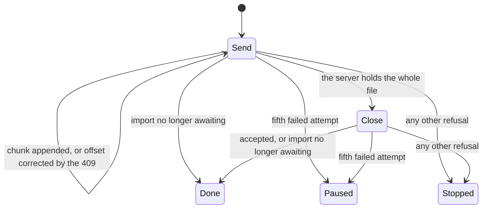

fix: the data travels closes on the holistic review's findings

The closing block of the lot `the-data-travels`. At the operator's request the holistic review ran on the top of the stack before any merge, and found 1 MAJOR and 11 MINOR. This pull request fixes them, then corrects the handoff, the backlog and three contradictions in the specification.

## Why

The MAJOR is in the web application's upload of an import archive. The upload store lives above the router and outranks the server's row in the account screen and the task centre while it holds an upload. Closing the upload (`POST .../archive/complete`) was a single shot outside the chunk loop, so any trouble there *stopped* the upload, and a stopped upload stayed in the store for the tab's life with **Cancel as its only control**:

- a close whose answer was lost on the way back stopped the upload, although the server had already moved the import to `PENDING` and would run it. Cancel then sent `DELETE` on a running import;
- the losing tab of two tabs uploading one import (a known limit the operator accepted, "Q1") ended in the same position, on `IMPORT_NOT_AWAITING_ARCHIVE`.

Three MINOR findings sat on the same seam, the moment the upload hands over to the server's row:

| Situation | Before | After |
|---|---|---|
| Close answer lost | Upload stopped, Cancel over a `PENDING` import | Close sent again; the `409` hands over to the server's row |
| Another tab closed first | Same, with "This import no longer accepts an archive" | The server's row shows |
| Upload succeeds | "The upload of pinry.zip stopped before the end" for one round trip | Straight from 100 % to the server's row |
| Cancel refused during an upload | Silent: the component holding the mutation had unmounted | The refusal shows, the upload goes on |
| A read of the latest import begun before the import opened | Could delete the fresh resume record | The tab's own upload keeps its record |

## How

The close joins the loop. Both a chunk and the close are an *attempt* the pure `nextStep` (in `lib/`, inside the coverage bound) decides on, so the close gets the chunks' retry schedule for free. A new `DONE` step, distinct from `STOP`, means "the server has moved on": the close accepted, or `IMPORT_NOT_AWAITING_ARCHIVE` answered to either request. The store still only performs what `nextStep` answers.

The handover then follows one rule: **the upload leaves the store only once the latest import has been read again**, on `DONE` and on a successful cancel alike. That removes the flash, keeps the upload view (and its refusal) mounted while a cancel settles, and hides nothing behind a stale row. `IMPORT_NOT_AWAITING_ARCHIVE` no longer stops anything, so its sentence left both catalogues.

The MINOR findings off that seam are housekeeping: the journeys' row fixtures typed by the contract, the empty list routes #227's defaults made redundant removed from seven journeys, a journey case for a refused opening, catalogue formatting, comments that cited "decision D1" or "section 2" without the document, and the missing KDoc on `maxImportArchiveBytes`. One finding is kept: the `ImportsConfig` comment carried by #222 stays, as the review itself suggests.

The two-tabs limit gets a pointer under Known limits in `docs/backlog.md`. The handoff's merge figures and the operator's reading of the stack exist only after the merges, and are left to fill then.

Block report, for the handoff

**Position.** Closing block of `the-data-travels`, branch `fix/the-data-travels-closes`, stacked on #228 (block 65), top of a stack of ten pull requests, none merged.

**Evidence.**
- Gate: `dagger call gate` green at `6de14f7b`, exit 0. Clients: 55 files, 280 tests; `src/lib` coverage 100 % of lines and branches.
- Continuous integration: run 36160705746, green, `verify` 7 min 49 s.
- Budget against `feat/the-task-centre-keeps-data-notices`: 278 lines, 18 files.
- Red before the fix: the three new behaviour cases (the flash, the lost close, the refused cancel) failed against the unfixed store. The refused-opening case passed already: a coverage gap, not a defect.
- Headless reading (Firefox, stubbed API, 1280 and 380 px, the section's text sampled every 25 ms): the success goes from 100 % straight to "The archive is waiting to be imported." with no frame of the reload sentence; with every close cut for a second, the section holds at 100 % and sends the close again 5 s later, then the `409` hands over to the pending import; a refused cancel shows "That could not be done. Try again in a moment." under the running progress bar. No horizontal overflow at 380 px.

**Departures from the plan.**
- Wrap ran before the merges: the holistic review read `origin/feat/the-task-centre-keeps-data-notices` in place of `origin/main`, before the operator's reading, at the operator's request ("Lance la revue holistique avant que je relise").
- The handoff was corrected from the lead's log and the review, still before any merge.

**Tier-1 fixes** (review `.reviews/the-data-travels-holistic.md`, not committed; each exit is in the handoff's "The holistic review" table):
- MAJOR: stopped upload outranking the server's row with Cancel only; lost close turned into a stop. Fixed.
- MINOR, all fixed: success flash of the reload sentence; silent refused cancel; record pruned by a read begun before the import opened; fixtures accepting any state string; redundant empty list routes (the three named journeys and four data journeys); no test for a refused opening; catalogue formatting churn; comments citing a decision or section without the document; the specification contradicting its corrections (Branches header, section 5, section 6); `maxImportArchiveBytes` without KDoc.
- MINOR, kept: the `ImportsConfig` comment in a web application block (`eef0c88f` took it out of block 10 for the file bound, `ddabed5a` in #222 carried it back).
- Two findings were partly wrong: #222's 264 lines do count the `ImportsConfig` comment (2 lines, 1 file), and `maxFileBytes` and `maxPixels` carry no KDoc either.

**Tier-2 questions.** None in this block. Operator decisions recorded in the handoff: "Q1", the two-tabs resume risk is an accepted known limit with no guard; the holistic review run on the top of the stack before the reading.

**Pitfalls.**
- Firefox resends a `POST` cut on a reused connection by itself, up to four times within the same millisecond: a stub that cuts only the first close tests the browser's retry, not the application's.

**Not verified / left to fill.**
- The handoff's merge figures (wall-clock time, review latency, cascaded rebases) and the operator's reading of the stack experiment: to fill after the operator's review and the last merge.
- No guard against two tabs uploading one import (accepted, "Q1").
- Screens read headless against a stubbed API only, never against the running API.

🤖 Generated with [Claude Code](https://claude.com/claude-code)
