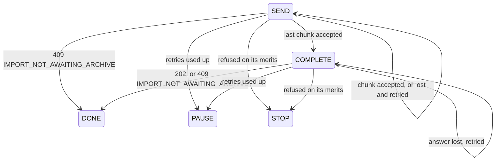

fix(webapp): the data travels, the holistic review's findings

The closing block of the lot `the-data-travels`. The holistic review ran on the top of the stack before any merge, at the operator's request, and found 1 MAJOR and 11 MINOR. This pull request answers them, and brings the handoff, the backlog and the specification in line with what the lot became.

## The MAJOR: an upload that outlived its import

The upload's close was a single request outside the retry loop that sends the chunks. If its answer was lost, the upload was marked stopped, even though the server had often already accepted the close. The stopped upload lives in the tab's store, and the store outranks the server's row in the import section and the task centre. So the user saw "stopped" over an import that was in fact `PENDING` or `RUNNING`, with Cancel as the only button, and Cancel would `DELETE` that import. The losing tab of the two-tabs case ended in the same position, through `IMPORT_NOT_AWAITING_ARCHIVE` on a chunk.

The fix treats the close like any chunk, as one more attempt in the same pure state machine (`lib/imports.ts`), and gives the upload a final state where it hands over to the server:

Sending the close again is safe because the API accepts only one close. A second close gets `409 IMPORT_NOT_AWAITING_ARCHIVE`, and that answer now means "the server has moved on" rather than "stop". In `DONE`, the tab forgets the file record, reads the latest import again, and only then leaves the store. The server's row therefore takes over with no frame in between. `IMPORT_NOT_AWAITING_ARCHIVE` never reaches the user any more, so its sentence left both catalogues.

## The MINOR findings that change behaviour

- **A success flashed "The upload of pinry.zip stopped before the end"** for one round trip. The same "leave the store only after the row is read" rule fixes it.
- **A refused cancel was silent**, because the upload left the store before the `DELETE` and the component that held the mutation unmounted. Now the upload stays until the `DELETE` has succeeded and the row has been read. A refused cancel shows its error under the progress bar, which keeps running.
- **A read of the latest import that began before an import opened could prune that import's fresh resume record.** This happened on the window refocus after the file dialog closes. Pruning now spares the record of the tab's own upload, and a finished upload removes its own record.

The other MINOR findings are cleanup: the journeys' row fixtures are typed by the contract, redundant list routes are gone, a new journey covers a refused opening, the catalogues are reformatted, comments no longer point at "decision D1" with no document named, and `maxImportArchiveBytes` has a KDoc. Only one finding was not fixed: the `ImportsConfig` comment stays in `api/`, for the reason given in the handoff.

On the documents side: the operator accepted two tabs uploading one import as a known limit with no guard (answer "Q1"). `docs/backlog.md` now points to it under Known limits. The handoff and the specification carry `(Corrected: ...)` entries rather than rewrites.

Block report, for the handoff

**Position.** Closing block of `the-data-travels`, branch `fix/the-data-travels-closes`, stacked on #228 (block 65), at the top of a stack of ten pull requests with none merged.

**Evidence.**
- Gate: `dagger call gate` green at `6de14f7b`, exit 0. Clients: 55 files, 280 tests. `src/lib` coverage is 100 % of lines and branches.
- CI: run 36160705746, green, `verify` 7 min 49 s.
- Budget against `feat/the-task-centre-keeps-data-notices`: 278 lines, 18 files.
- Red before the fix: the three new behaviour cases (the flash, the lost close, the refused cancel) failed against the unfixed store. The refused-opening case already passed, so it filled a coverage gap and fixed no defect.
- Headless reading (Firefox, stubbed API, 1280 and 380 px, the section's text sampled every 25 ms):
  - On success, the section goes from 100 % straight to "The archive is waiting to be imported." with no frame of the reload sentence.
  - With every close cut for a second, the section holds at 100 % and sends the close again 5 s later. The 409 then hands over to the pending import.
  - A refused cancel shows "That could not be done. Try again in a moment." under the running progress bar.
  - No horizontal overflow at 380 px.

**Findings and exits (tier 1).** All 1 MAJOR and 11 MINOR from `.reviews/the-data-travels-holistic.md` (not committed) are fixed except `ImportsConfig`, which is kept and recorded in the handoff. The handoff's "The holistic review" table gives each exit.

**Departures from the plan.**
- Wrap ran on the top of the stack before the merges and before the operator's reading, at the operator's request. It read `origin/feat/the-task-centre-keeps-data-notices` in place of `origin/main`.
- Two findings were partly wrong. #222's 264 lines do count the `ImportsConfig` comment (2 lines, 1 file). `maxFileBytes` and `maxPixels` carry no KDoc either.
- The specification got three corrections: the Branches header, section 5 and section 6.

**Tier-2 questions.** None in this block. The operator's answers recorded here came from earlier: "Q1" (two tabs, an accepted limit with no guard), and running the holistic review before their reading.

**Pitfall.** Firefox resends a POST cut on a reused connection by itself, up to four times within the same millisecond. A stub that cuts only the first close tests the browser's retry, not the application's.

**Not verified / left to fill.** The two-tabs case has no guard, by decision. Three things wait on the operator's review and the merges: the handoff's merge figures, the experiment's figures, and the operator's reading. They are filled in before this block merges and the handoff freezes.

🤖 Generated with [Claude Code](https://claude.com/claude-code)
